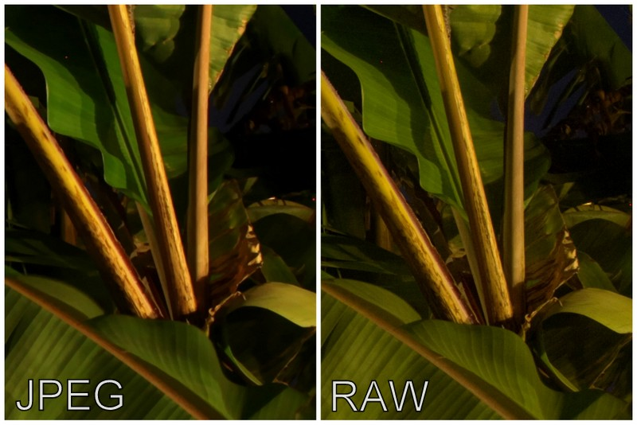

### Topic: Data Preprocessing.

After learning about Neural Networks and Deep Learning, we moved on to learn about Data preprocessing and its procedures. Before learning about Data Preprocessing, we did some revisions on previous unit and then moved onto the next session. Here are some of the points we discussed in the class on the particular topic and session:

### Revision on Data-preprocessing from our previous module(DSF 101)

Preprocessing is necessary in a dataset because it helps clean, organize, and transform the data into a format that is suitable for analysis or modeling. It is essential to prepare the data for analysis, making it easier to understand, analyze, and derive conclusions from. And some of the simple preprocessing techniques used are Handling missing values, Normalization, Feature scaling, and Feature Engineering.

### Text preprocessing

Then I came to know that text preprocessing is a process of cleaning and preparing text data before it is used for analysis or modeling. It helps improve the quality of text data and makes it easier for algorithms to extract meaningful conclusions or perform tasks such as text classification, or topic modeling. Some of the libraries that are used while preprocessing are Pandas, Numpy and NLTK. 

#### 1.Is text discrete or continuous data?

Since text data consists of discrete elements (words,chracters,etc) rather than continous measurement it is considered a discrete data which consists of separate, distinct values with clear boundaries between them.

#### 2.Operations on text data.

Some of the operations that we could perform on text data are Tokenization(breaking text into smaller units like words or phrases), Stemming and Lematization(Normalizing words to thier base form) and Text classification(assigning labels to text documents based on their content).

### Image Data

Here first we discussed that images are stored in the form of pixel(a individual square unit that can display information). Some of the image format consists of JPEG, PNG, SVG and PDF.

#### 1.JPEG

JPEG which is referred to as Joint Photographic Experts Group is used in image compression that reduces the file size of the digital images while maintaining the visual quality. It is not suitable for images with text overlays as it does not support alpha channels.

Example:

#### 2.PNG

PNG which is referred to as Portable Network Graphics is used on  web and digital graphics as it supports lossless compression(can repeatedly be edited and saved) without losing image quality. But the disadvantages of using it is that it tends to produce larger file sizes compared to other image format.

Example: 

#### 3.SVG

SVG which is referred to as Scalable Vector Graphics is an XML-based vector image format used in creating 2-D graphics unlike raster images format like JPEG and PNG. It uses mathematical formulas to describe shapes, lines and colors amking it resolution-independent and scalable without using image quality. THe disadvantage of using SVG image is that it may not be suitable for complex images with high level detail or phographic content.

Example:

#### 4.PDF

PDF which is reffered to as Portable Document Format is used for sharing documents across different platforms while maintaining their orginal formatting. Though it can be viewed and printed on any device or operating system without requiring the orginal file,it can be inconvinient when updates or changes are needed requiring the orginal authoe to have access to the source document.

Example: 

### Compression Algorithms

Here we first discussed about what Lossless and Lossy compression is. Lossless is a type of compression that retains all the orginal data when decompressed and Lossy compression is a type of compression that sacrifices some data quality to achieve higher levels of compression. We usually compress an image to reduce its file size but we usaully don't compress an image when lossy compression methods can degrade image quality, when editing or processing images and for long-term storage to preserve image quality and detail over time.

### Conclusion

In conclusion, data preprocessing is a crucial step in preparing data for analysis or modeling, involving techniques like handling missing values, normalization, and feature engineering. Text preprocessing involves cleaning and organizing text data for analysis, with operations like tokenization and text classification. Image data comes in formats like JPEG, PNG, SVG, and PDF, each with its advantages and disadvantages. Compression algorithms like lossless and lossy compression help reduce file sizes, but careful consideration is needed to maintain image quality. Overall, understanding these concepts is essential for effectively working with different types of data in data science and machine learning tasks.

