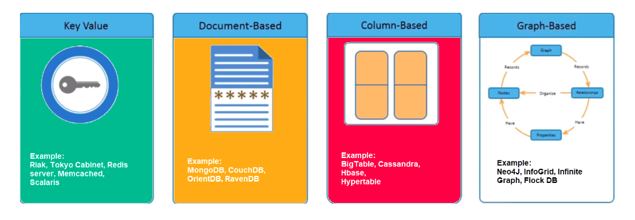
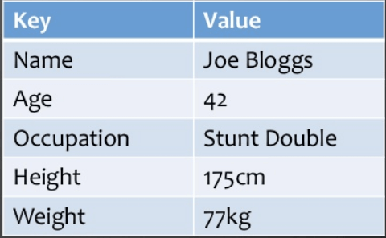
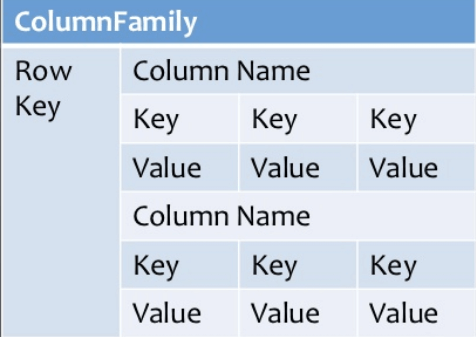
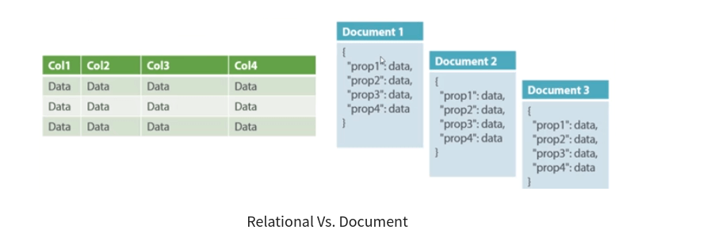
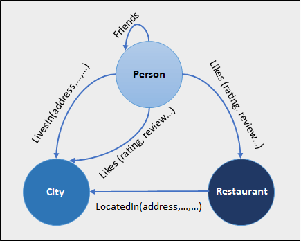
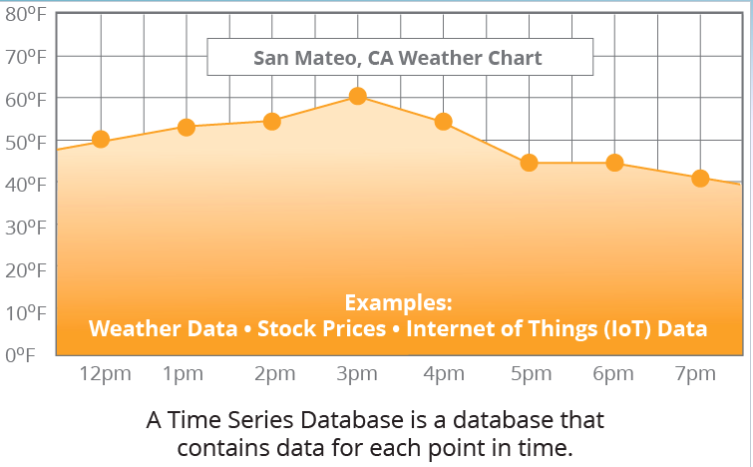
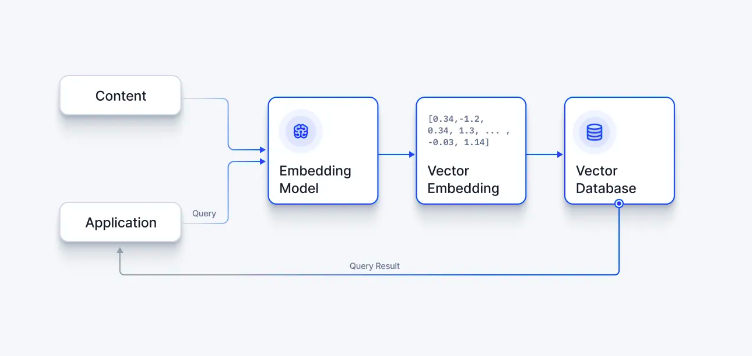

### Topic : Advantages, Disadvantages and Applications of types of Nonrelational Databases.

### Lesson learned from flipped class.

In today's world where we use a lot of data, we need ways to store it efficiently and in a way that can grow as our needs grow. That's where non-relational databases, also called NoSQL databases, come in. Unlike the traditional relational databases that organize data into neat little tables, these newer databases are more flexible. They can handle all sorts of different types of data and can handle a lot of it at once. Let's talk about why these databases are great, what  some of the downsides are, and where we use them along with its definition and types based on my understanding.

### What is NO Sql?

NoSQL Database is a non-relational Data Management System, that does not require a fixed schema. It avoids joins, and is easy to scale. The major purpose of using a NoSQL database is for distributed data stores with humongous data storage needs. NoSQL is used for Big data and real-time web apps. For example, companies like Twitter, Facebook and Google collect terabytes of user data every single day.

### Type of No SQL Database.

NoSQL Databases are mainly categorized into six types: Key-value pair, Column-oriented, Graph-based, Time series, Vector-based and Document-oriented. Every category has its unique attributes and limitations. None of the above-specified database is better to solve all the problems. Users should select the database based on their product needs.

 

### 1. Key Valued Pair Based.

Data is stored in key/value pairs. It is designed in such a way to handle lots of data and heavy load. Key-value pair storage databases store data as a hash table where each key is unique, and the value can be a JSON, BLOB(Binary Large Objects), string, etc.

For example, a key-value pair may contain a key like “Name” associated with a value like “Dorji”.

It is one of the most basic NoSQL database example. This kind of NoSQL database is used as a collection, dictionaries, associative arrays, etc. Key value stores help the developer to store schema-less data. 

### Applications.

1. Quick Data Storage: Imagine having a bunch of keys (like in a real-life keychain) and each key is connected to a small piece of information. That's how key-value pair databases work. They store data in a simple way: we have a key and its corresponding value. This makes it really easy to store and find information quickly.

2. Online Shopping Carts: When we add items to our online shopping cart, key-value pair databases can keep track of what we have selected. Each item is linked to our unique ID, so when we come back later, our cart is still filled with the items we picked out.

3. Managing Website Sessions: Websites keep us logged in even when we navigate to different pages? Key-value pair databases help with that too. They store our session ID along with our user information, so the website can recognize us and keep us logged in as we browse around.

### 2. Column Based

Column-oriented databases work on columns. Every column is treated separately. Values of single column databases are stored contiguously.

They deliver high performance on aggregation queries like SUM, COUNT, AVG, MIN etc. as the data is readily available in a column.Cassandra, HBase, Hypertable are NoSQL query examples of column based database.

### Applications

1. Data Warehouses: Column-based NoSQL databases are used to store and analyze large volumes of data collected from various sources, allowing businesses to perform complex analytics and generate insights to support decision-making.

2. Business Intelligence: These databases help businesses gather, store, and analyze data to gain insights into their operations, customers, and market trends, enabling them to make informed strategic decisions and drive growth.

3. Customer Relationship Management (CRM): Column-based NoSQL databases are used to manage and analyze customer data, including interactions, preferences, and purchasing behavior, to improve customer satisfaction, retention, and sales effectiveness.

4. Library Card Catalogs: These databases store information about library resources, such as books, journals, and multimedia materials, allowing users to search, browse, and access library collections efficiently.

### 3.Document Based Database

Document-Oriented NoSQL DB stores and retrieves data as a key value pair but the value part is stored as a document. The document is stored in JSON or XML formats. The value is understood by the DB and can be queried.

In the above diagram on the left we can see we have rows and columns, and in the right, we have a document database which has a similar structure to JSON. Now for the relational database, we have to know what columns we have and so on. However, for a document database, we have data store like JSON object. We do not require to define which make it flexible.Amazon SimpleDB, CouchDB, MongoDB, Riak, Lotus Notes, MongoDB, are popular Document originated DBMS systems.

### Applications

1. Content Management Systems (CMS): Document databases are extensively employed in CMS platforms for storing and managing various types of content, such as articles, images, and videos, providing flexibility in handling unstructured data.

2. Blogging Platforms: Document databases serve as the backend storage for blogging platforms, enabling efficient storage and retrieval of blog posts, comments, and user-generated content, while accommodating dynamic content updates.

3. Real-time Analytics: In real-time analytics applications, document databases support rapid ingestion and analysis of streaming data, allowing businesses to derive actionable insights from continuous data streams with low latency.

4. E-commerce Applications: Document databases power e-commerce platforms by efficiently storing product catalogs, customer profiles, and transaction data, facilitating personalized shopping experiences and streamlined order processing.

5. Complex Transactions: While document databases excel in storing and retrieving diverse data types, they may not be suitable for handling complex transactions that involve multiple interrelated operations or queries requiring sophisticated data aggregations and transformations.

### 4. Graph Database

A graph type database stores entities as well the relations amongst those entities. The entity is stored as a node with the relationship as edges. An edge gives a relationship between nodes. Every node and edge has a unique identifier.

Compared to a relational database where tables are loosely connected, a Graph database is a multi-relational in nature. Traversing relationship is fast as they are already captured into the DB, and there is no need to calculate them.Neo4J, Infinite Graph, OrientDB, FlockDB are some popular graph-based databases.

### Applications

1. Social Networks: Graph databases are extensively utilized in social networks for modeling relationships between users, posts, likes, comments, and other interactions, enabling efficient traversal of connections and personalized content recommendations.

2. Logistics: In logistics, graph databases facilitate route optimization, supply chain management, and tracking of goods by representing nodes as locations and edges as transportation routes or connections, enabling real-time decision-making and efficient resource allocation.

3. Spatial Data: Graph databases are instrumental in spatial data applications for representing and analyzing geographic features, such as maps, roads, points of interest, and their relationships, enabling spatial queries, proximity searches, and location-based services with high performance and accuracy.

### 5. Time Series Database

A time-series database (TSDB) is a computer system that is designed to store and retrieve data records that are part of a “time series,” which is a set of data points that are associated with timestamps. The timestamps provide a critical context for each of the data points in how they are related to others. Time series data is often a continuous flow of data like measurements from sensors and intraday stock prices. A time-series database lets you store large volumes of timestamped data in a format that allows fast insertion and fast retrieval to support complex analysis on that data.

A Time Series Database is a database that contains data for each point in time. 

### Application

1. IoT Data: Time series databases are widely used in Internet of Things (IoT) applications for storing and analyzing sensor data, telemetry data, and device metrics collected over time, enabling monitoring, predictive maintenance, and anomaly detection in IoT systems.

2. Financial Services: In financial services, time series databases are employed for storing and analyzing market data, stock prices, trading volumes, and other financial metrics over time, enabling trend analysis, risk assessment, and algorithmic trading strategies.

3. Monitoring and Alerting: Time series databases are utilized in monitoring and alerting systems for collecting, storing, and analyzing performance metrics, system logs, and event data from IT infrastructure, enabling real-time monitoring, troubleshooting, and proactive alerting of issues.

4. Environmental Monitoring: Time series databases are used in environmental monitoring applications for tracking environmental parameters, such as temperature, humidity, air quality, and pollution levels over time, enabling analysis of environmental trends, climate change studies, and decision-making in environmental management.

5. Healthcare: In healthcare, time series databases are employed for storing and analyzing patient vitals, medical sensor data, and electronic health records over time, enabling remote patient monitoring, disease surveillance, and personalized healthcare interventions.

### 6. Vector Based Database

A vector database is a specialized database designed to store and retrieve vector embeddings, which are numerical arrays representing various characteristics of an object. These embeddings are the distilled representations of the training data in machine learning processes, serving as the filter through which new data is run during the inference part of the machine learning process. Vector databases are becoming increasingly popular in AI and machine learning, finding use in applications ranging from next-generation search engines to Large Language Models.

### Application

1. Machine Learning and Data Analytics: Vector-based databases are widely used in machine learning and data analytics applications for storing and analyzing high-dimensional data, such as feature vectors, embeddings, and numerical data representations, enabling efficient similarity searches, clustering, classification, and regression tasks.

2. Image Recognition and Computer Vision: In image recognition and computer vision applications, vector-based databases are employed for storing and querying image features, descriptors, and embeddings extracted from images, enabling fast and accurate image search, content-based retrieval, and object recognition.

3. Natural Language Processing (NLP): Vector-based databases play a crucial role in natural language processing applications for representing and querying word embeddings, document vectors, and semantic embeddings extracted from text data, enabling semantic search, document similarity analysis, and text classification tasks.

4. Recommendation Systems: In recommendation systems, vector-based databases are utilized for storing user profiles, item embeddings, and contextual features, enabling personalized recommendations, content-based filtering, and collaborative filtering techniques for e-commerce, media, and entertainment platforms.

5. Genomics and Bioinformatics: Vector-based databases are employed in genomics and bioinformatics applications for storing and querying genetic sequences, protein sequences, and molecular structures represented as vectors, enabling sequence alignment, similarity analysis, and biological data mining tasks.

### Advantages of NoSQL

1. Can be used as Primary or Analytic Data Source

2. Big Data Capability

3. No Single Point of Failure

4. Easy Replication

5. No Need for Separate Caching Layer

6. It provides fast performance and horizontal scalability

7. Can handle structured, semi-structured, and unstructured data with equal effect

8. Object-oriented programming which is easy to use and flexible

9. NoSQL databases don’t need a dedicated high-performance server

10. Support Key Developer Languages and Platforms

11. Simple to implement than using RDBMS

12. It can serve as the primary data source for online applications.

13. Handles big data which manages data velocity, variety, volume, and complexity

14. Excels at distributed database and multi-data center operations

15. Eliminates the need for a specific caching layer to store data

16. Offers a flexible schema design which can easily be altered without downtime or service disruption

### Disadvantages of NoSQL

1. No standardization rules

2. Limited query capabilities

3. RDBMS databases and tools are comparatively mature

4. It does not offer any traditional database capabilities, like consistency when multiple transactions are performed simultaneously.

5. When the volume of data increases it is difficult to maintain unique values as keys become difficult

6. Doesn’t work as well with relational data

7. The learning curve is stiff for new developers

8. Open source options so not so popular for enterprises.

In conclusion, non-relational databases, or NoSQL databases, offer flexibility and scalability for handling diverse data types and large volumes of information. They are utilized across various industries and applications, including content management systems, e-commerce, real-time analytics, and IoT. While each type of NoSQL database has its advantages and limitations, users can choose the most suitable database based on their specific requirements. Whether it's storing simple key-value pairs, managing complex relationships in graph databases, or analyzing time-stamped data in time series databases, NoSQL databases play a crucial role in modern data management and analytics.

### What I did in flipped class.

Before our flipped class session started, our tutor briefly taught us about the topics of normal forms, and notes were provided via Google Chat for reference during the flipped class. Then, we were divided into 6 groups, each with a different topic on types of NoSQL database forms. In our groups, we discussed the assigned topic for around 30 minutes. After the allotted time, we were reorganized into different groups, with each member assigned a different topic to share their knowledge. Following the discussions, our tutor asked questions to members to assess their understanding of the concepts discussed in the second group. After several question-and-answer sessions, our class concluded.

### How can flipped class be Improved.

Having regular check-ins or quizzes on the pre-class materials would help reinforce learning and ensure us to stay on track. Additionally, providing additional resources for further exploration of the topics covered would be beneficial for deeper understanding.