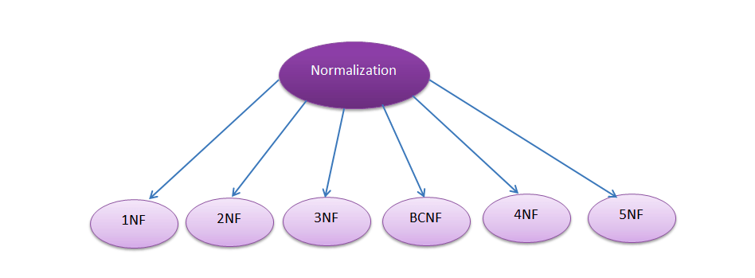
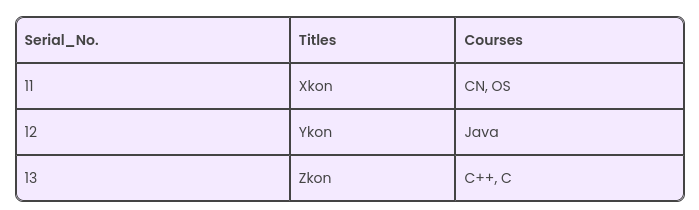
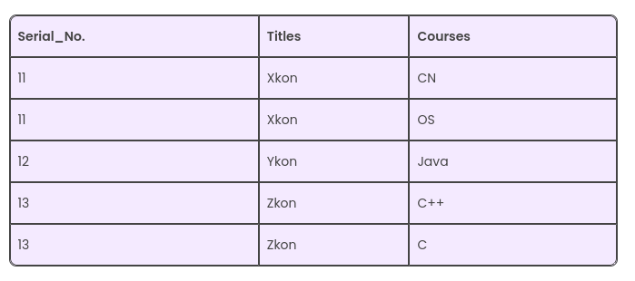
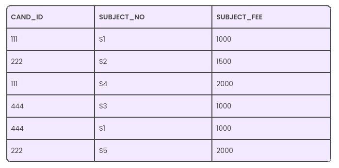
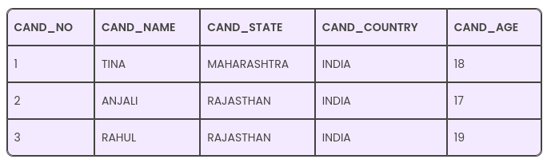
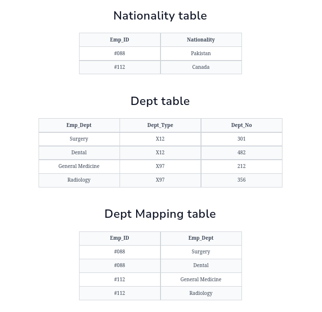

### Topic : Relational Database Design

### Lesson learned from flipped class.

In the field  of databases, normal forms plays a crucial role in organizing data efficiently. They help ensure that data is stored in a structured and logical manner, reducing redundancy and improving data integrity. Now let's take a look onto normal forms and their types based on my understanding.

### Normalization and its type.

Normalization is the process of organizing data in a database to eliminate redundancy and dependency. It helps in achieving database efficiency, ensuring that each piece of data is stored only once and in the most appropriate place. It consists of 5 diiferent types of normal forms which include First Normal Form(1NF), Second Normal Form(2NF), Third Normal Form(3NF), Fourth Normal Form(4NF), Fifth Normal Form(5NF) and Boyce-Codd Normal Form(BCNF).

### 1.First Normal Form (1NF)

A table is in First Normal Form (1NF) if all the attributes of the table are made up solely of atomic values. If a table has multivalued data items in attributes or composite values, the relation can’t be in the first normal form. It need to be changed to the first normal form by making the entries of the table atomic.

Rules to Followed in 1st Normal Form: 

1. The Attributes must be Single Valued
Every column in your table must be single-valued. It means that no columns should have multiple values in a single cell. In case we don’t have single values in a cell, we won’t be able to call it 1NF.For instance, if we take a look at a table that consists of data regarding a single novel and its writers, and it has the following columns: [Book ID], [Writer 1], [Writer 2], and [Writer 3]. In this case, [Writer 1], [Writer 2], and [Writer 3] repeat the same attribute. They do not refer to different Book 1Ds. Thus, this table would not be in 1NF.

2. Every value stored in every table column must be of the same type/ kind. Random values should not make up the table.For instance, if a table consists of a column named DOB that saves the date of birth of various people, we cannot use this column to save the names of these people. We need a separate column for that. Every column must hold separate sets of attributes in a DBMS table.

3. Every Column/ Attribute must have a Unique Name.A 1NF table expects that every column present in a table consists of a unique name of its own. This way, it becomes feasible to avoid any confusion while the system is retrieving, editing, or adding data, or performing any other operations on the table. In case multiple columns have a similar name, then the system will be confused in the end.

4. The order of Data does not matter.

Example:

Here, we can see there are multiple values in similar columns. We can resolve it as follows:

This way, although a few values are getting repeated, we can still see that there is just one value in every column.

### 2.Second Normal Form (2NF)

A relation is said to be in the 2nd Normal Form in DBMS (or 2NF) when it is in the First Normal Form but has no non-prime attribute functionally dependent on any candidate key’s proper subset in a relation. A relation’s non-prime attribute refers to that attribute that isn’t a part of a relation’s candidate key.

Example: 

In this table, you can note that many subjects come with the same subject fee. 
Thus, we can conclude that the attribute SUBJECT_FEE is a non-prime one since it doesn’t belong to the candidate key here {SUBJECT_NO, CAND_ID};But, on the other hand, the SUBJECT_NO – > SUBJECT_FEE, meaning the SUBJECT_FEE depends directly on the SUBJECT_NO, and it forms the candidate key’s proper subset. Here, the SUBJECT_FEE is a non-prime attribute, and it depends directly on the candidate key’s proper subset. Thus, it forms a partial dependency and its not in form of 2nd Normal Form.

Now the tables are in form of Second Normal Form.

### 3.Third Normal Form (3NF)

A given relation is said to be in its third normal form when it’s in 2NF but has no transitive partial dependency. Meaning, when no transitive dependency exists for the attributes that are non-prime, then the relation can be said to be in 3NF.In a relation that is in 1NF or 2NF, when none of the non-primary key attributes transitively depend on their primary keys, then we can say that the relation is in the third normal form of 3NF.

Example: 

For the relation given here in the above table, CAND_NO -> CAND_STATE and CAND_STATE -> CAND_COUNTRY are actually true. Thus, CAND_COUNTRY depends transitively on CAND_NO. This transitive relation violates the rules of being in the 3NF. So, if we want to convert it into the third normal form, then we have to decompose the relation CANDIDATE (CAND_NO, CAND_NAME, CAND_STATE, CAND_COUNTRY, CAND_AGE) as; CANDIDATE (CAND_NO, CAND_NAME, CAND_STATE, CAND_STATE, CAND_AGE).

### 4.Boyce-Codd Normal Form(BCNF)

BCNF stands for Boyce-Codd normal form, which is a special case of 3NF and is also known as 3.5 NF. BNCF is a normal form used in the normalization of databases and has more strict rules as compared to 3NF.3NF states that the transitive dependency must not exist. Transitive dependency is that the LHS (left-hand side) of the functional dependency must consist of a super key/candidate key or the RHS (right-hand side) must have a prime attribute. BCNF adds more restrictions by stating that LHS of functional dependency must have a super key and removes the RHS condition.

Rules in BCNF:

a) The table must be in 3NF form.
   
b)For any dependency X → Y, X must be a candidate key or super key. In other words, for dependency X → Y, if Y is a prime attribute, X cannot be a non-prime attribute.

Example:

For the above example the Functional dependencies are; Emp_ID → Nationality, Emp_Dept → {Dept_Type, Dept_No} and the Candidate key are; Nationality Table:Emp_ID, Dept Table: Emp_Dept,Dept Mapping Table: {Emp_ID, Emp_Dept}. The relation is now in BCNF form because it satisfies both conditions which are that the table is already in 3NF form and on the LHS of the functional dependency there is a candidate key.

### 5.Fourth Normal Form
 
The Fourth Normal Form (4NF) is a level of database normalization that builds upon the concepts of the Third Normal Form (3NF) by addressing multi-valued dependencies in a relational database. In simple terms, 4NF ensures that a database table is free from certain types of redundancies and anomalies that can arise from complex dependencies between attributes.

Rules in 4NF:

a) A relation will be in 4NF if it is in Boyce Codd normal form and has no multi-valued dependency.

b) For a dependency A → B, if for a single value of A, multiple values of B exists, then the relation will be a multi-valued dependency.

Example:

The given STUDENT table is in 3NF, but the COURSE and HOBBY are two independent entity. Hence, there is no relationship between COURSE and HOBBY. In the STUDENT relation, a student with STU_ID, 21 contains two courses, Computer and Math and two hobbies, Dancing and Singing. So there is a Multi-valued dependency on STU_ID, which leads to unnecessary repetition of data.

So to make the above table into 4NF, we can decompose it into two tables:

### 6.Fifth Normal Form

The Fifth Normal Form (5NF) is a level of database normalization that aims to further reduce redundancy and dependency in a relational database schema. It deals with the concept of join dependencies, which occur when a table can be decomposed into multiple tables in such a way that joining them back together yields the original table.

Rules in 5NF:

a) A relation is in 5NF if it is in 4NF and not contains any join dependency and joining should be lossless.

b) 5NF is satisfied when all the tables are broken into as many tables as possible in order to avoid redundancy.

c) 5NF is also known as Project-join normal form (PJ/NF).

Example:

In the above table, John takes both Computer and Math class for Semester 1 but he doesn't take Math class for Semester 2. In this case, combination of all these fields required to identify a valid data.Suppose we add a new Semester as Semester 3 but do not know about the subject and who will be taking that subject so we leave Lecturer and Subject as NULL. But all three columns together acts as a primary key, so we can't leave other two columns blank.

So to make the above table into 5NF, we can decompose it into three relations P1, P2 & P3:

To conclude there are different levels of organization called normal forms, like 1NF, 2NF, 3NF, BCNF, 4NF, and 5NF. Each form tackles specific problems, from making sure data is single and straightforward in 1NF to handling complex connections between tables in 5NF. By following these rules, databases can store and find data more efficiently. This helps ensure that information is accurate and easy to access, making the database work better overall.

### What I did in flipped class

Before our flipped class session started, our tutor briefly taught us about the topics of normal forms, and notes were provided via Google Chat for reference during the flipped class. Then, we were divided into 6 groups, each with a different topic on types of normal forms. In our groups, we discussed the assigned topic for around 30 minutes. After the allotted time, we were reorganized into different groups, with each member assigned a different topic to share their knowledge. Following the discussions, our tutor asked questions to members to assess their understanding of the concepts discussed in the second group. After several question-and-answer sessions, our class concluded.

### How can flipped class be improved

I think it would help us learn better if the madam could start the flipped class session with some basics on the topic, like it was done in Flipped Class session 5.