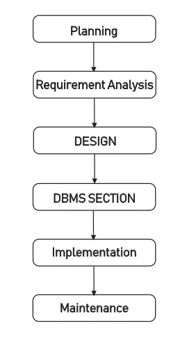

### Topic : Tasks on Storage and buffer management - Simulate disk blocks, RAID configurations, and buffer pools.

#### Introduction:
Databases are like super organized libraries for computer information. They help store a lot of data and find it super fast when needed. In this guide, we'll take a look at some important things about databases, like how they work and why they are essential.

#### Exploring How Databases Store Stuff:
Let's start by learning how databases store information. We'll talk about things like how computers save data in little chunks called blocks, how they make sure data stays safe with backups, and how they keep track of where everything is.

#### Figuring Out What is Needed:
When we want to make a new database, we first need to think about what we want it to do. This means figuring out what information we want to keep, like names or numbers, and how they're connected. We also think about how people will use the database, like adding new information or finding old stuff.

#### Making the Database Blueprint:
Once we know what we need, we start planning how to organize everything. It's like making a map of our database. We use tricks like getting rid of extra stuff we don't need and making sure everything is organized neatly. This helps the database work faster and better.

#### Using Cool Tricks to Make Things Faster:
Databases have some neat tricks to find stuff super quickly. They use special tables and indexes, like a super fast index in a book, to find information in a snap. They also make sure everything happens smoothly when people ask questions, so they don't have to wait forever for an answer.

#### Making Sure Everything Stays Safe:
Keeping data safe is really important. Databases use special tools to make sure everything stays safe and accurate, even if something goes wrong. They keep a record of changes (like a diary), so they can go back and fix things if needed. They also make sure only the right people can see and change the data, so it stays private and secure.

#### Conclusion.:
So, that's the basics of databases! I learned how they store and organize information, how they find things quickly, and how they keep everything safe. By being honest and making smart choices, we can use databases to make our lives easier and our information safer.

