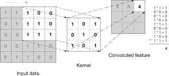
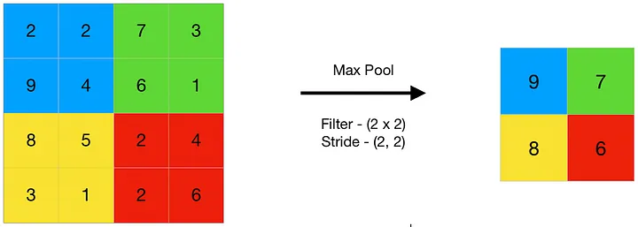

### Topic : Understanding Convolutional Neural Networks 

In this journal, I am excited to share the fascinating world of Convolutional Neural Networks (CNNs), the powerhouse behind much of today’s computer vision technology. From recognizing faces to detecting objects in videos, CNNs play a crucial role in interpreting visual information. Let's explore how these networks function and why they are so effective.

#### What is a Convolutional Neural Network (CNN)?

A Convolutional Neural Network, or CNN, is a type of computer program that's very good at processing images. It can look at a picture and figure out what’s in it—like finding cats in photos or recognizing street signs in videos.

#### How Does a CNN Work?

Imagine using a little magnifying glass to look at different parts of a picture. Each time you move the magnifying glass around, you see only a small portion of the picture. This is similar to what a CNN does with something called a kernel or filter (think of it as a tiny looking glass). The CNN slides this kernel over the entire image, focusing on one small area at a time.

#### What Happens When CNN Looks at an Image?

Each small area the CNN looks at is transformed by this kernel. The kernel has a special job: to highlight certain features like edges, colors, or shapes. It’s like looking through different colored sunglasses to see which parts of the picture stand out with each color.

Important Terms in CNNs:

Kernel Size: This is the size of the "magnifying glass" the CNN uses to look at the image.

Padding: Sometimes the CNN adds extra invisible borders around the image so that the kernel can fully cover the edges without missing out on any parts of the picture.

Stride: This tells the CNN how far to move its "magnifying glass" across the image each time. A bigger stride means it jumps farther across the image, skipping more of the picture in between.

Input Channels: This refers to the number of color layers in the image. Most colored images have three (red, green, and blue).

Output Channels/Feature Maps: These are new images created by the CNN after looking at the original image with its kernel. Each one shows different parts of the image that stood out.

#### What About Pooling?

Pooling Layers, also known as downsample layers, are an essential component of convolutional neural networks (CNNs) used in deep learning. They are responsible for reducing the spatial dimensions of the input data, in terms of width and height, while retaining the most important information.

Pooling Layers divide the input data into small regions, called pooling windows or receptive fields, and perform an aggregation operation, such as taking the maximum or average value, within each window. This aggregation reduces the size of the feature maps, resulting in a compressed representation of the input data.

#### How Pooling Layers Works

The process of Pooling Layers involves the following steps:

Divide the input data into non-overlapping regions or windows.
Apply an aggregation function, such as max pooling or average pooling, on each window to obtain a single value.
Combine the values obtained from each window to create a downsampled representation of the input data.
Pooling Layers can be applied multiple times in a deep learning model, progressively reducing the spatial dimensions of the feature maps.

#### Types of Pooling Layers:

#### 1. Max Pooling

Max pooling is a pooling operation that selects the maximum element from the region of the feature map covered by the filter.

Thus, the output after max-pooling layer would be a feature map containing the most prominent features of the previous feature map.

#### 2. Average Pooling

Average pooling computes the average of the elements present in the region of feature map covered by the filter.

Thus, while max pooling gives the most prominent feature in a particular patch of the feature map, average pooling gives the average of features present in a patch.

#### 3. Min pooling 

Min pooling is a pooling operation that selects the minimum element from the region of the feature map covered by the filter.

Thus, the output after min-pooling layer would be a feature map containing the least prominent features of the previous feature map.

#### What's the Difference Between Valid and Same Convolution?

#### Valid Convolution:

In valid convolution, the filter is applied only to positions where the filter and the input fully overlap.

As a result, the output size will be smaller than the input size because there are fewer positions where the filter can be applied without extending beyond the boundaries of the input.

Valid convolution is often used when you don't mind losing some information at the edges of the input, or when you want to reduce the spatial dimensions of the feature maps.

#### Same Convolution:

In same convolution, the filter is applied to all positions, including those where the filter extends beyond the boundaries of the input.

To ensure that the output has the same spatial dimensions as the input, padding is added to the input data. Typically, zero-padding is used.

With same convolution, the output size remains the same as the input size, as the padding compensates for the loss of spatial dimensions caused by applying the filter.

Same convolution is often used when you want to preserve the spatial dimensions of the feature maps, especially in scenarios where maintaining spatial information is crucial, such as in image segmentation tasks.

#### Simple Example to Understand

If you use a tiny 1x1 kernel on a 5x5 image without adding any borders (padding), the output will still be a 5x5 image. Since the kernel is just looking at one pixel at a time, it doesn't change the size of the image.

#### Conclusion 

Understanding and working with CNNs is like peeling an onion. Each layer reveals more complexity and power, enabling these networks to perform incredible performances of image recognition. They are not just mathematical constructs but powerful tools that help machines see the world, opening up endless possibilities across various fields. For instance, if you apply a simple 1x1 kernel to a 5x5 image using valid convolution, you’d end up with the same 5x5 output dimensions, as the kernel slides over each pixel without altering the overall size. This simplicity yet profound capability exemplifies why CNNs are foundational to modern AI in image analysis.

I hope this journal on CNNs has revealed how these networks function and why they're so integral to advancements in AI and machine learning. The journey through the layers of a CNN is not just about technology; it's about expanding our ability to interact with and understand the world through digital eyes.