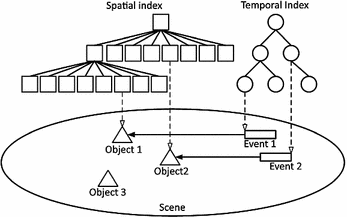
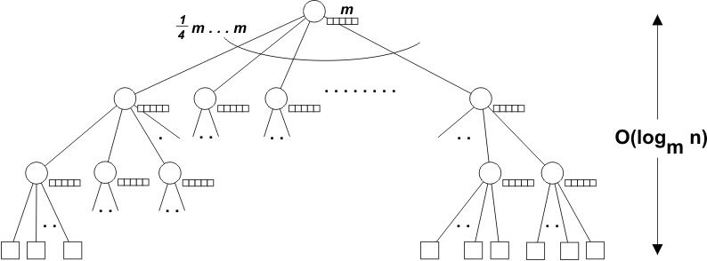

### Topic : Indexing.

Efficient management of spatial and temporal data is paramount in numerous fields, from geographic information systems to real-time analytics. To address the complexities of multidimensional data, specialized indexing techniques such as Bitmap Indices and Buffer Trees have been developed. Bitmap Indices utilize bitmap encoding to expedite query processing, while Buffer Trees offer a tailored structure for spatial data organization. This journal will talk about the methodologies, examining their principles, strengths, and limitations, with the aim of optimizing data retrieval efficiency in spatial and temporal contexts based on my understnading for each topics that has been discussed in the class.

#### Indexing of Spatial and Temporal Data
A spatiotemporal database is a database that manages both space and time information. 

Common examples include; Tracking of moving objects, which typically can occupy only a single position at a given time, a database of wireless communication networks, which may exist only for a short timespan within a geographic region, an index of species in a given geographic region, where over time additional species may be introduced or existing species migrate or die out and historical tracking of plate tectonic activity.

Spatiotemporal databases are an extension of spatial databases and temporal databases. A spatiotemporal database embodies spatial, temporal, and spatiotemporal database concepts, and captures spatial and temporal aspects of data and deals with; geometry changing over time or location of objects moving over invariant geometry (known variously as moving objects databases or real-time locating systems).

#### Bitmap Indices

A database index is a data structure that is used to quickly locate and retrieve data from a database table. Indexes work by creating a separate structure that stores the values from a specific column of a table, along with a pointer to the corresponding row in the table. When a query is run against the table, the index can be used to quickly locate the rows that match the search criteria, rather than having to scan the entire table.

Bitmap indexing is a type of indexing that is particularly well-suited for data with a small number of distinct values, such as gender or product type. A value of 1 in a bit indicates that the corresponding row in the table has the indexed value, while a value of 0 indicates that it does not.

For example, consider a database table with a column called "Gender", which can have the values "Male" or "Female". To create a bitmap index on this column, we would create a bitmap for each of the two values. The bitmap for "Male" would have a 1 in the bit position for each row in the table where the gender is male, and a 0 in all other positions. The bitmap for "Female" would be the opposite, with 1s in the positions for rows where the gender is female and 0s in all other positions.

#### Advantages of Bitmap Indexing

There are several advantages to using bitmap indexing in a database:

1) As mentioned above, bitmap indexes are particularly efficient at filtering and retrieving data from large tables with a small number of distinct values. This is because they allow the DBMS to quickly identify the rows that match the search criteria using bitwise operations, rather than having to scan the entire table.

2) Bitmap indexes tend to be more space efficient than other types of indexes, such as B-tree indexes, especially when the indexed column has a large number of distinct values. This is because each bit in the bitmap represents a row in the table, rather than storing the full value of each row in the index.

3) Bitmap indexes are often used in data warehousing applications, where queries tend to be more complex and involve filtering and aggregating large amounts of data.

#### Buffer Tree

A Buffer Manager is responsible for allocating space to the buffer in order to store data into the buffer.If a user request a particular block and the block is available in the buffer, the buffer manager provides the block address in the main memory.If the block is not available in the buffer, the buffer manager allocates the block in the buffer.If free space is not available, it throws out some existing blocks from the buffer to allocate the required space for the new block.The blocks which are thrown are written back to the disk only if they are recently modified when writing on the disk.
If the user requests such thrown-out blocks, the buffer manager reads the requested block from the disk to the buffer and then passes the address of the requested block to the user in the main memory.However, the internal actions of the buffer manager are not visible to the programs that may create any problem in disk-block requests. The buffer manager is just like a virtual machine.

For serving the database system in the best possible way, the buffer manager uses the for:

#### 1. Buffer Replacement Strategy

If no space is left in the buffer, it is required to remove an existing block from the buffer before allocating the new one. The various operating system uses the LRU (least recently used) scheme. In LRU, the block that was least recently used is removed from the buffer and written back to the disk. Such type of replacement strategy is known as Buffer Replacement Strategy.

#### 2. Pinned Blocks

If the user wants to recover any database system from the crashes, it is essential to restrict the time when a block is written back to the disk. In fact, most recovery systems do not allow the blocks to be written on the disk if the block updation being in progress. Such types of blocks that are not allowed to be written on the disk are known as pinned blocks. Luckily, many operating systems do not support the pinned blocks.

#### 3. Forced Output of Blocks

In some cases, it becomes necessary to write the block back to the disk even though the space occupied by the block in the buffer is not required. When such type of write is required, it is known as the forced output of a block. It is because sometimes the data stored on the buffer may get lost in some system crashes, but the data stored on the disk usually does not get affected due to any disk crash.

### Conclusion 

In wrapping up, learning about indexing techniques like Bitmap Indices and Buffer Trees has shown me how they make finding data easier and faster. These methods use special ways to organize information, which is super helpful, especially for things like maps or tracking time-based events. Understanding these tools helps us see how to handle data smarter and more efficiently as we keep moving forward in the world of information.

### What I did in flipped class.

At the start of the Flipped Class session, instructions for the group work was provided earlier with the links which contains note for references.Then followed by a 5-minute period for group formation which was kind of fun because our tutor came with an interesting idea of forming  a group by singing a song around 2 verses where the ones with same are in same group.

 Then after the formation of the group we were provided with 25 minutes for group discussions were each group was provided with different topics, then followed by another 25 minutes for group discussion within quiz groups. Finally, a 30-minute quiz was done with 2 groups participating each group containing 12 members and after this it concluded the session, testing participants' comprehension and application of the material covered.

### How can flipped class be Improved.

If more of quiz thing is done in flipped class it would be more fun and it would lead to effective learning.

