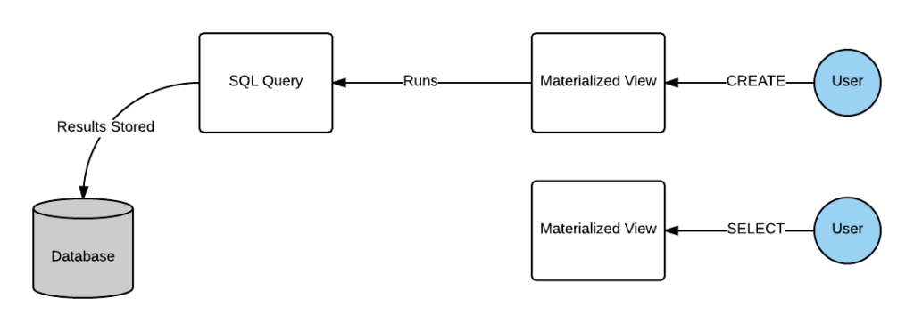
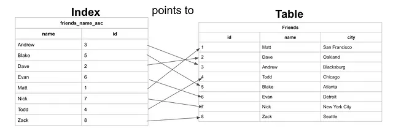
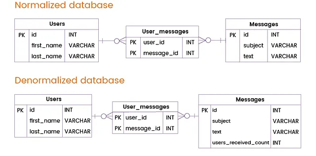
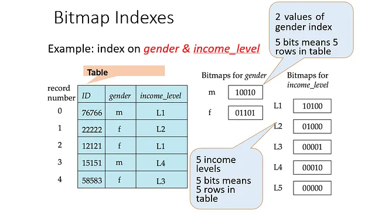

### Topic : Query Processing and Optimization.

As I learn more about databases and how to make them work better, I have come across two important ideas: materialized views and advanced query optimization techniques. These ideas help make databases faster and more efficient. In this journal entry, I will explain what they are and why they're useful.

#### What are Materialized Views?

Materialized views are a database object that stores the result of a query physically. Unlike regular views, which are virtual and re-execute the underlying query each time they are accessed, materialized views store the query result and can be refreshed periodically. This makes them extremely useful for speeding up query performance, especially for complex and resource-intensive queries.

Example:

#### Benefits of Materialized Views

- Improved Query Performance: By storing the result set of a query, materialized views eliminate the need to re-execute the query, significantly reducing the time it takes to retrieve data.
- Reduced Computation Load: Since the data is precomputed, the computational load on the database server is reduced, freeing up resources for other tasks.
- Real-Time Data Access: Materialized views can be refreshed at regular intervals, ensuring that the data remains up-to-date while still providing quick access.

#### How Materialized Views Work?

Materialized views work by precomputing and storing the results of a specific query as a physical table in the database. The database performs the precomputation at regular intervals, or users can trigger it by specific events. Administrators monitor the performance and resource utilization of materialized views to ensure they continue to meet their intended purpose.

Here's a general overview of how materialized views work.

#### Create materialized view

You define a query that retrieves the desired data from one or more source tables for creating materialized views. This query may include filtering, aggregations, joins, and other operations as needed.

The database initially populates the materialized view by running the defined query against the source data. The result of the query is stored as a physical table in the database, and this table represents the materialized view.

#### Update materialized view
The data in a materialized view needs to be periodically updated to reflect changes in the underlying data in the source tables. The data refresh frequency depends on the use case and requirements.

Next, we explain a few common approaches for data refresh.

#### Full refresh 
The materialized view is completely recomputed and overwritten with the latest query results. It is the simplest approach but can be resource-intensive, especially for large materialized views.

#### Incremental refresh
Only the changes in the underlying data are applied to the materialized view. It can be more efficient than a full refresh when dealing with large datasets and frequent updates.

#### On-demand refresh
Some systems allow materialized views to be refreshed on demand, triggered by specific events or user requests. This gives more control over when the data is updated, but it requires careful management to ensure the materialized view remains up-to-date.

#### Technical variations in different systems

Each database management system has distinct methods for creating a materialized view.

#### What’s the difference between views and materialized views?
In relational databases, a view is a temporary table created by transforming and combining the data across multiple base tables. It’s a virtual table that does not store any data itself. Instead, it’s defined by a query against one or more source tables.

Whenever a user queries the view, the database engine dynamically computes the results by running the underlying query against the source tables. The data in a view is always up-to-date because it’s derived directly from the source tables each time it’s accessed.

A materialized view, on the other hand, stores the results of a specific query as a physical table in the database. The data in the materialized view is precomputed and stored, meaning that the results are already available without the need to recompute the query each time the view is accessed.

However, the data in materialized views is not always up-to-date. It have to configure the update frequency to balance between data freshness and query performance.

#### The Importance of Query Optimization

Query optimization is vital for ensuring the performance and scalability of applications and systems that rely on databases. Slow queries can negatively impact user experience and operational efficiency. Furthermore, query optimization can save computational resources and, consequently, reduce costs.

#### Basic Optimization Strategies

- Efficient Indexing: Proper use of indexes to accelerate record retrieval.
- Reducing Returned Data: Selecting only the necessary columns and limiting results.
- Avoiding Redundant Queries: Caching query results or preventing redundant queries.

#### Advanced Query Optimization Techniques
#### 1. Query Explainers

Query explanation tools, such as the EXPLAIN command in PostgreSQL, help understand how the database executes a query. This allows the identification of performance bottlenecks and the optimization of the execution plan.

#### Pros:

- Provides detailed information about how the database executes a query.
- Helps identify performance bottlenecks, such as missing indexes or inefficient execution plans.
- Facilitates making informed decisions for query optimization.

#### Cons:

- May require technical expertise to interpret results.
- Does not automatically solve issues; it is a diagnostic tool.
- Use Cases:

- Identifying and optimizing slow queries.
- Checking the effectiveness of indexes and execution plans.

#### 2. Index Optimization

In addition to creating indexes, it is essential to choose suitable index types, such as composite, partial, or functional indexes, to meet specific query requirements.

#### Pros:

- Significantly improves the performance of search queries.
- Reduces the need for full table scans, saving resources.

#### Cons:

- Indexes consume additional disk space.
- Index maintenance can impact write performance.

#### Use Cases:

- Frequent search queries on specific fields.
- Queries involving joins and sorting.

#### 3. Batch Queries

Processing multiple operations in a single batch can reduce system overhead by minimizing the number of database connections and queries.

#### Pros:

- Reduces system overhead by processing multiple operations in a single transaction.
- Minimizes the number of database calls, improving performance.

#### Cons:

- Requires careful planning to avoid concurrency issues.
- May increase code complexity.

#### Use Cases:

- Updating records in multiple tables in a single transaction.
- Batch data import.

#### 4. In-Memory Storage

Using in-memory databases like Redis for queries that require low latency can significantly speed up read operations.

#### Pros:

- Provides fast data access, reducing latency.
- Suitable for caching results of frequently executed queries.

#### Cons:

- In-memory data can be volatile and require update strategies.
- The hardware cost for in-memory storage can be high.

#### Use Cases:

- Caching results of queries in read-intensive systems.
- Temporary storage of data not requiring long-term persistence.

#### 5. Data Denormalization

In read-intensive scenarios, data denormalization can be an effective strategy, reducing the need for complex joins.

#### Pros:

- Reduces the need for complex joins in queries.
- Improves read performance, especially in complex queries.

#### Cons:

- Increases the required disk space to store duplicated data.
- Can make write operations more complex and prone to anomalies.

#### Use Cases:

- Frequent queries involving multiple tables in read-intensive systems.
- Data analysis systems (data warehousing) where query performance is critical.

#### 6. Bitmap Index Usage

Bitmap indexes are an advanced technique particularly useful in scenarios with low cardinality, where field values have a limited number of different occurrences. Instead of creating traditional indexes, bitmap indexes record which records contain specific values in fields. This is useful for queries involving filters on categorical fields, such as “status” or “type.”

#### Pros:

- Efficient for queries involving filtering on fields with low cardinality.
- Reduces the space occupied by indexes compared to traditional indexes.

#### Cons:

- Less effective for fields with high cardinality.
- Updating records can be more costly due to the need to update bitmap indexes.

#### Use Cases:

Queries that filter records by status, type, or other categories with a limited number of values.

#### 7. Table Partitioning
Table partitioning is an advanced technique that divides a large table into smaller partitions based on specific criteria, such as a range of values in a column. This can significantly improve query performance, especially when dealing with large volumes of data.

#### Pros:

- Accelerates queries on tables with large data volumes.
- Facilitates the deletion of old or archived data.

#### Cons:

- Requires careful planning and maintenance of partitions.
- Complexity can increase compared to a single table.

#### Use Cases:

- Storing log records or temporal data on a large scale.
- Data division into partitions for archiving or deletion purposes.

#### 8. Query Rewrite
Query rewriting involves modifying queries to more efficient forms. This can include simplifying complex queries, using subqueries, or rewriting correlated queries as JOIN operations.

#### Pros:

- Can transform inefficient queries into more optimized forms.
- Improves query performance by reducing complexity.

### Cons:

- Requires deep knowledge of SQL and query analysis.
- May involve rewriting complex and long queries.

#### Use Cases:

- Optimization of complex and suboptimal queries.
- Performance improvement of analytical and reporting queries.

Database query optimization is a complex discipline that involves choosing the right strategies and techniques based on the specific requirements and challenges of each system. Each advanced technique has its advantages and disadvantages, and the choice depends on the context and project priorities.

The ability to identify performance bottlenecks, optimize queries, and make informed decisions is essential for maintaining the performance and scalability of systems that rely on databases. By carefully applying these techniques and acquiring additional knowledge through recommended books, it will be better prepared to tackle performance-related challenges in your applications.

### Conclusion

Learning about materialized views and advanced query optimization techniques is key to making databases run faster and more efficiently. Materialized views save query results for quick access, and advanced optimization techniques ensure queries run smoothly and use fewer resources. These concepts are essential for anyone working with databases to understand and apply.

### What I did in flipped class.

Before the flipped class session, our tutor covered some lessons that were left out in the previous class. After that, we were divided into subgroups to discuss a particular topic for which notes were provided beforehand. We were divided into groups such that two groups discussed the same topic, resulting in a total of four different topics being covered.

After the initial discussions, we regrouped so that each new group included members who had discussed different topics. We then shared insights from our respective topics. Following a brief discussion, we were instructed to create quiz questions to compete with the other teams. Each team came up with a total of four quiz questions.

At the end of the session, we conducted the quiz. Both teams were provided with sweets, but the winning team received a better version of chocolates. And that’s how our flipped class session concluded.

### How can flipped class be Improved.

No further change is required!.
