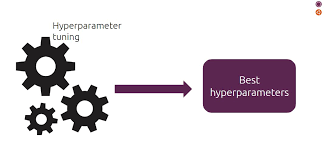
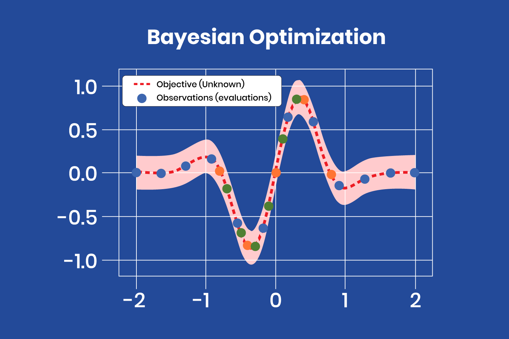
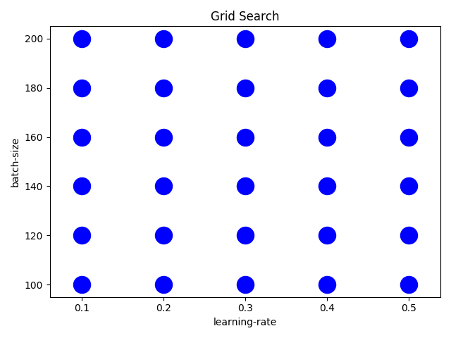
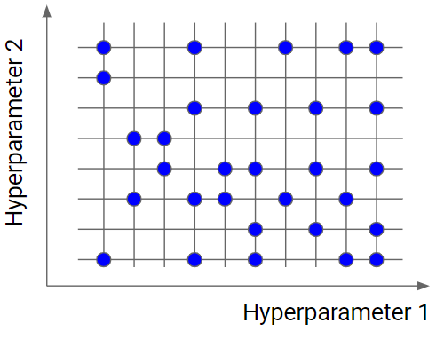
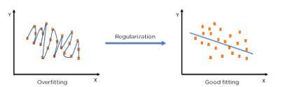
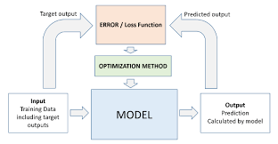

### Topics: Hyperparamter Tuning, Regularization and Optimization.

In my learning journey through machine learning, I have discovered that making a model work well involves carefully adjusting different settings. This includes tuning hyperparameters, applying regularization to prevent overfitting, and optimizing the model to find the best parameters. These steps are essential for creating models that perform well and are reliable. So, I will share what I have learned about these three critical aspects in the following parts.

### What is hyperparameter tuning?

When training a machine learning models, each dataset and model needs a different set of hyperparameters, which are a kind of variable. The only way to determine these is through multiple experiments, where it picks a set of hyperparameters and run them through the model. This is called hyperparameter tuning. In essence, training a model sequentially with different sets of hyperparameters. This process can be manual, or can be picked base on one of several automated hyperparameter tuning methods.

Whichever method is to use, it is required to track the results of the experiments. It will then apply some form of statistical analysis, such as the loss function, to determine which set of hyperparameters gives the best result. Hyperparameter tuning is an important and computationally intensive process.

### What are hyperparameters?

Hyperparameters are external configuration variables that data scientists use to manage machine learning model training. Sometimes called model hyperparameters, the hyperparameters are manually set before training a model. They're different from parameters, which are internal parameters automatically derived during the learning process and not set by data scientists.

Examples of hyperparameters include the number of nodes and layers in a neural network and the number of branches in a decision tree. Hyperparameters determine key features such as model architecture, learning rate, and model complexity.

### Why is hyperparameter tuning important?

Hyperparameters directly control model structure, function, and performance. Hyperparameter tuning allows data scientists to tweak model performance for optimal results. This process is an essential part of machine learning, and choosing appropriate hyperparameter values is crucial for success.

For example, consider the learning rate as a hyperparameter. If the value is too high, the model may converge too quickly with suboptimal results. Conversely, if the rate is too low, training takes too long and results may not converge. A balanced choice of hyperparameters results in accurate models and excellent model performance.

### How does hyperparameter tuning work?

As previously stated, hyperparameter tuning can be manual or automated. Manual tuning, while slow and tedious, helps in understanding how hyperparameter weightings affect the model. However, in most instances, well-known hyperparameter tuning algorithms are used.

The process of hyperparameter tuning is iterative, involving trying out different combinations of parameters and values. It generally starts by defining a target variable, such as accuracy, as the primary metric to be maximized or minimized. Using cross-validation techniques is recommended to ensure the model is not centered on a single portion of the data.

### What are the hyperparameter tuning techniques?

Numerous hyperparameter tuning algorithms exist, with the most commonly used types being Bayesian optimization, grid search, and randomized search.

#### Bayesian Optimization:

Bayesian optimization is based on Bayes’ theorem, which describes the probability of an event occurring related to current knowledge. Applied to hyperparameter optimization, the algorithm builds a probabilistic model from a set of hyperparameters to optimize a specific metric. It uses regression analysis to iteratively choose the best set of hyperparameters.

#### Grid Search:

Grid search involves specifying a list of hyperparameters and a performance metric, and the algorithm works through all possible combinations to determine the best fit. While effective, grid search is relatively tedious and computationally intensive, especially with a large number of hyperparameters.

#### Random Search:

Random search operates on principles similar to grid search but selects groups of hyperparameters randomly on each iteration. It works well when a relatively small number of hyperparameters primarily determine the model outcome.

### What is regularization?

Regularization is a set of methods for reducing overfitting in machine learning models. Typically, regularization trades a marginal decrease in training accuracy for an increase in generalizability.

Regularization encompasses a range of techniques to correct for overfitting in machine learning models. As such, regularization is a method for increasing a model’s generalizability—that is, it’s ability to produce accurate predictions on new datasets.1 Regularization provides this increased generalizability at the sake of increased training error. In other words, regularization methods typically lead to less accurate predictions on training data but more accurate predictions on test data.

Regularization differs from optimization. Essentially, the former increases model generalizability while the latter increases model training accuracy.

#### Bias-variance tradeoff

The concession of increased training error for decreased testing error is known as bias-variance trade-off. Bias-variance tradeoff is a well-known problem in machine learning. It’s necessary to first define “bias” and “variance.” To put it briefly:

- Bias measures the average difference between predicted values and true values. As bias increases, a model predicts less accurately on a training dataset. High bias refers to high error in training.

- Variance measures the difference between predictions across various realizations of a given model. As variance increases, a model predicts less accurately on unseen data. High variance refers to high error during testing and validation.

Bias and variance thus inversely represent model accuracy on training and test sets respectively.2 Obviously, developers aim to reduce both model bias and variance. Simultaneous reduction in both is not always possible, resulting in the need for regularization. Regularization decreases model variance at the cost of increased bias.

Example Regularization:

### Types of Regularization with Linear Models

Linear Regression and Logistic Regression: Both are fundamental predictive models in machine learning. Linear regression predicts continuous outcomes, while logistic regression predicts categorical outcomes. As the number of predictors increases, regularization techniques are used to manage model complexity.

#### Forms of Regularization:

#### 1. Lasso Regression (L1 Regularization):

- Penalizes high-value, correlated coefficients by adding an absolute value term to the loss function.

- Can reduce some feature weights to zero, effectively removing them from the model.

#### 2. Ridge Regression (L2 Regularization):

- Penalizes high-value coefficients by adding a squared sum term to the loss function.

- Shrinks feature weights towards zero but does not remove them completely.

#### 3. Elastic Net Regularization:

- Combines both L1 and L2 penalty terms.

- Addresses multicollinearity and allows for feature selection by shrinking some coefficients to zero.

In all three techniques, the penalty strength is controlled by a hyperparameter called lambda (λ), which is often optimized using cross-validation.

### Types of Regularization in Machine Learning

#### Dataset:

#### Data Augmentation:

- Expands the training set by creating modified duplicates of existing data.

- Helps expose the model to more diverse data, especially useful for imbalanced datasets.

#### Model Training:

#### Early Stopping:

- Limits the number of training iterations to prevent overfitting.

- Stops training once validation accuracy stops improving.

#### Neural Networks:

#### Dropout:

- Randomly drops nodes and their connections during training.

- Trains multiple variations of the network, reducing overfitting by averaging these variations.

#### Weight Decay:

- Reduces the sum of squared network weights, similar to L2 regularization.

- Can decrease some neuron weights to zero, simplifying the network by removing less important nodes.

These regularization techniques help manage model complexity, prevent overfitting, and improve generalization, ensuring robust machine learning models.

#### 1. Why Optimize Machine Learning Models?

Optimization is crucial in machine learning as it helps us improve model performance by iteratively adjusting parameters to minimize or maximize a given function.

#### 2. Gradient Descent (GD):

- GD is an optimization algorithm that finds the local minima of a function by iteratively updating parameters.

- It works by calculating gradients and taking steps towards the minimum point.

- Learning rate (r) determines the step size, and it's crucial to adjust it to avoid oscillations.

#### 3. Stochastic Gradient Descent (SGD):

- SGD is a variant of GD that uses random samples instead of the entire dataset to compute gradients.

- This approach reduces computation time, making it suitable for large datasets.

- Despite its efficiency, SGD may converge to a suboptimal solution due to its randomness.

#### 4. Optimization in Logistic Regression:

- Gradient descent is commonly used in logistic regression to find the optimal plane after applying the sigmoid function.

- SGD is particularly useful in logistic regression when dealing with large datasets, as it significantly reduces computation time.

Optimization algorithms like GD and SGD play a vital role in training machine learning models. While GD is straightforward, SGD offers computational efficiency, making it suitable for large-scale applications. Understanding these optimization techniques is essential for building accurate and efficient machine learning models.

### Conclusion
In summary, optimizing, regularizing, and tuning hyperparameters are important steps in making strong machine learning models. We use methods like gradient descent to find the best settings for our models. Regularization techniques help prevent our models from getting too complicated and making mistakes. Hyperparameter tuning ensures that our models work as well as possible by adjusting important settings. By using these methods effectively, we can create models that work well in many different situations and give accurate results.

