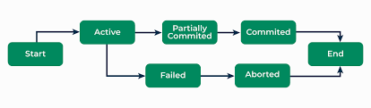
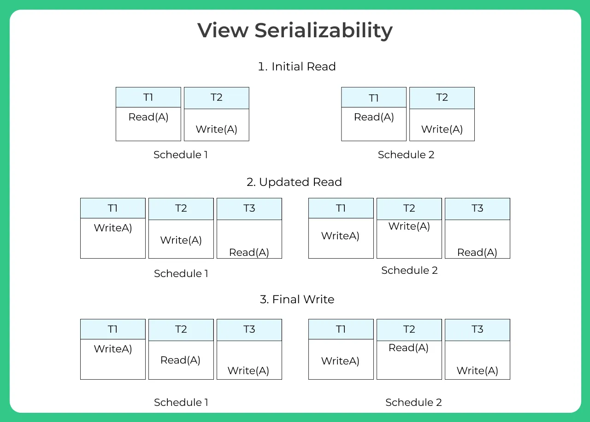
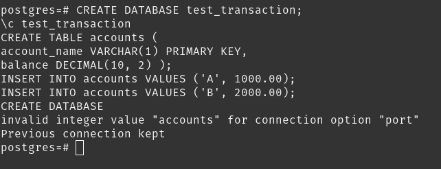
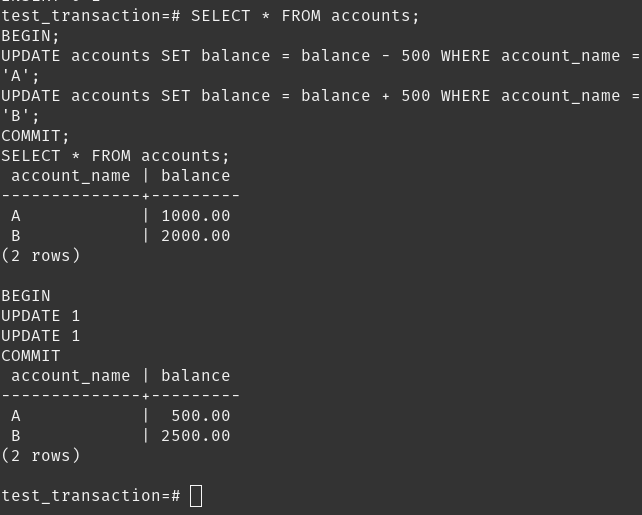
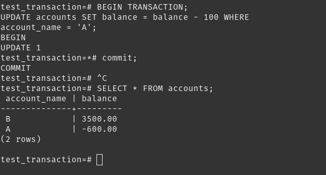
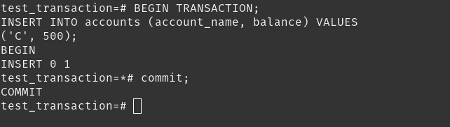
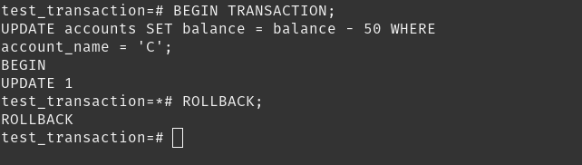
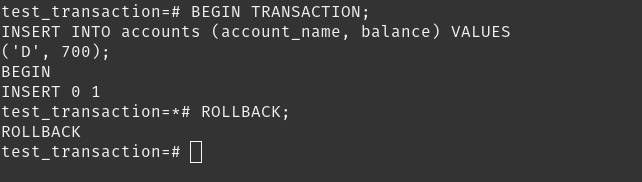
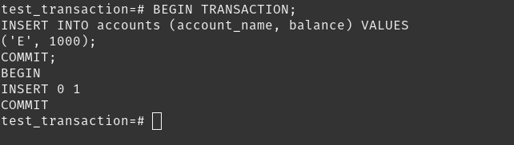
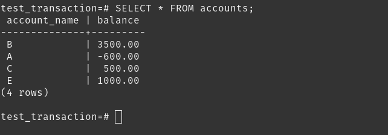

### Topic : Transaction and Serialzability

Hello, dear readers! Today, let's dive into the world of database management systems (DBMS) and explore an essential concept known as transactions based on my understanding and knowledge. If you've ever wondered how your favorite apps manage to save your data accurately and consistently, transactions play a big part in making that happen. Let's break it down into simple terms.

### What is a Transaction?
In the context of a DBMS, a transaction is a sequence of operations performed as a single logical unit of work. Think of it like a choreographed dance – every step is crucial, and it all has to go right to complete the dance correctly. If any step goes wrong, the whole dance needs to start over.

Transactions ensure that your data remains consistent, accurate, and reliable. They are crucial in scenarios where multiple operations are involved. For example, when you transfer money from one bank account to another, several steps are involved:

- 1. Deducting the amount from your account.

- 2. Adding the amount to the recipient's account.

These steps must either both succeed or both fail – you can't have money deducted from your account without it being added to the recipient's account!

### ACID Properties
To ensure reliability, transactions must follow the ACID properties:

- 1. Atomicity: This means that all the operations within a transaction are treated as a single unit. If one part of the transaction fails, the entire transaction fails and the database remains unchanged. It's like an all-or-nothing deal.

- 2. Consistency: Transactions must leave the database in a consistent state. This means that any data written to the database must be valid according to all defined rules, including constraints, cascades, and triggers.

- 3. Isolation: Transactions should not interfere with each other. Even if multiple transactions are occurring simultaneously, they should not affect each other’s execution. Imagine you're editing a document online while your friend is also making changes. You wouldn't want your edits to clash and create a mess, right? Isolation ensures that doesn't happen.

- 4. Durability: Once a transaction is committed, it is permanent. Even in the event of a system failure, the changes made by the transaction remain intact. It’s like saving your progress in a video game – once saved, you won't lose your progress even if the game crashes.

### Real-World Example
Let’s say you’re shopping online and decide to buy a book. Here's how a transaction might look in this scenario:

- You add the book to your cart.
- You enter your payment details and confirm the purchase.
- The system processes the payment.
- The system updates the inventory to reflect the purchase.

If any of these steps fail (for instance, if your payment doesn’t go through), the whole transaction is rolled back, and it’s as if you never tried to buy the book in the first place. This ensures you don’t lose money without getting your book and the store’s inventory remains accurate.

### Why Transactions Matter
Transactions are crucial for maintaining data integrity and consistency. Without them, databases would be prone to errors and inconsistencies, leading to unreliable applications. Whether it’s handling financial transactions, updating user profiles, or processing orders, transactions make sure everything runs smoothly and accurately.

### Conclusion
Understanding transactions in DBMS helps us appreciate how our data is managed behind the scenes. They ensure that our data remains accurate, consistent, and reliable, even in complex and concurrent operations. Next time you transfer money or make an online purchase, you can thank transactions for making sure everything goes smoothly!

### Serializability: Ensuring Data Consistency

Serializability is all about maintaining data consistency and integrity when multiple transactions are executed concurrently. Think of it as ensuring that the end result of executing transactions concurrently is the same as if they were executed one after another, in a serial manner.

### Understanding the Importance
Imagine a scenario where multiple users are accessing and modifying the same data simultaneously. Without serializability, there's a risk of data becoming inconsistent or corrupted due to conflicting transactions. Serializability ensures that the database remains in a consistent state, regardless of the order in which transactions are executed.

### Exploring Serialization Techniques
To achieve serializability, DBMS employ various serialization techniques. Two common approaches include strict two-phase locking and timestamp ordering. Each technique has its own set of advantages and trade-offs, balancing the need for concurrency control with performance optimization.

### Hands-On Learning Experience
In our recent class session, we had the opportunity to explore serializability firsthand. Through interactive exercises and guided discussions, we analyzed conflicting transactions and learned how serializability guarantees data consistency by enforcing proper transaction execution order.

### Transaction Isolation Levels
We also delved into transaction isolation levels, such as Read Committed and Serializable. These levels determine the degree to which transactions are isolated from one another, impacting concurrency and data consistency within the DBMS environment.

### Conclusion: Empowering Database Design
Understanding serializability is essential for designing and managing efficient and reliable database systems. By ensuring that transactions are executed in a consistent and predictable manner, serializability plays a crucial role in upholding the ACID properties (Atomicity, Consistency, Isolation, Durability) of database transactions.

### What I did in flipped class.

In our class this time, rather than doing a flipped classroom approach, our tutor taught us directly in class. Following the lecture, we had a guided session where we did:

1. Createing a database named test_transaction, connecting to it, createing an accounts table with columns for account names and balances, and inserts two initial records into the table.

2. Selecting all records from the accounts table, begins a transaction, transfers 500 units from account 'A' to account 'B' by updating their balances, commits the transaction to save the changes, and then selects all records from the accounts table again to show the updated balances.

3. Showing transaction processing: The first begins a transaction and deducts 100 from account 'A'. 

4. The second begins a transaction, inserts account 'B' with a 500 balance, and commits the change.

5. Begining a transaction, attempts to update the balance of a non-existent account 'C', simulating an error, and then rolls back the transaction to undo any changes.

6.  Begining a transaction, attempts to insert a new account 'D' with a balance of 700 (simulating an error), and then rolls back the transaction to undo the changes.

7. Begining a transaction, inserts a new account 'E' with a balance of 1000, and then commits the transaction to save the changes.

8. Selecting all records from the accounts table, displaying the account names and their respective balances.

In the guided session firstly, we established a database named test_transaction, created an accounts table, and populated it with initial records. Subsequently, we explored transactional operations by transferring funds between accounts and committing the changes. Through various scenarios, such as deducting from one account and inserting into another, we gained insights into transaction processing and error handling. We simulated errors by attempting to update non-existent accounts and inserting erroneous data, highlighting the importance of rollback functionality in maintaining data integrity. Finally, we successfully committed transactions, adding new accounts and updating balances.

### How can flipped class be Improved.

No further change is required!.

