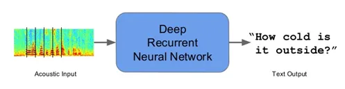

### Topics: Sequence Model and Recurrent Neural Network (RNN)

Sequence models and Recurrent Neural Networks (RNN) are powerful tools in machine learning, designed to handle data that comes in sequences, such as time series, text, or speech. Unlike traditional neural networks, RNNs have connections that form loops, allowing information to persist and be used across different steps in a sequence. This unique feature makes them especially effective for tasks where context and order are crucial, such as language translation, speech recognition, and time series prediction. In this journal, I will share the basic ideas of the fundamental concepts of sequence models and RNNs, their architecture, and their applications based on my understanding.

#### Sequence Models
Sequence models are the machine learning models that input or output sequences of data. Sequential data includes text streams, audio clips, video clips, time-series data and etc. Recurrent Neural Networks (RNNs) is a popular algorithm used in sequence models.

### Applications of Sequence Models
### 1. Speech recognition: 

In speech recognition, an audio clip is given as an input and then the model has to generate its text transcript. Here both the input and output are sequences of data.

### 2. Sentiment Classification: 

In sentiment classification opinions expressed in a piece of text is categorized. Here the input is a sequence of words.

### 3. Video Activity Recognition: 

In video activity recognition, the model needs to identify the activity in a video clip. A video clip is a sequence of video frames, therefore in case of video activity recognition input is a sequence of data.

These examples show that there are different applications of sequence models. Sometimes both the input and output are sequences, in some either the input or the output is a sequence. Recurrent neural network (RNN) is a popular sequence model that has shown efficient performance for sequential data.

### Recurrent Neural Networks (RNNs)

Recurrent Neural Network (RNN) is a Deep learning algorithm and it is a type of Artificial Neural Network architecture that is specialized for processing sequential data. RNNs are mostly used in the field of Natural Language Processing (NLP). RNN maintains internal memory, due to this they are very efficient for machine learning problems that involve sequential data. RNNs are also used in time series predictions as well.

.png)

The main advantage of using RNNs instead of standard neural networks is that the features are not shared in standard neural networks. Weights are shared across time in RNN. RNNs can remember its previous inputs but Standard Neural Networks are not capable of remembering previous inputs. RNN takes historical information for computation.

### RNN Architectures

There are several RNN architectures based on the number of inputs and outputs,
1. One to Many Architecture: Image captioning is one good example of this architecture. In image captioning, it takes one image and then outputs a sequence of words. Here there is only one input but many outputs.

2. Many to One Architecture: Sentiment classification is one good example of this architecture. In sentiment classification, a given sentence is classified as positive or negative. In this case, the input is a sequence of words and output is a binary classification.

3. Many to Many Architecture: There are two cases in many to many architectures,
- The first type is when the input length equals to the output length. Name entity recognition is one good example where the number of words in the input sequence is equal to the number of words in the output sequence.
- The second type of many to many architecture is when input length does not equal to the output length. Machine translation is one good scenario for this architecture. In machine translation, RNN reads a sentence in one language and then converts it to another language. Here input length and output length are different.

.jpeg>)

### Long Short-Term Memory (LSTM)
Traditional RNNs are not good at capturing long-range dependencies. This is mainly due to the vanishing gradient problem. When training very deep network gradients or the derivatives decreases exponentially as it propagates down the layers. This is known as Vanishing Gradient Problem. These gradients are used to update the weights of neural networks. When the gradients vanish then the weights will not be updated. Sometimes it will
completely stop the neural network from training. This vanishing gradient problem is a common issue in very deep neural networks.

LSTM is a modification to the RNN hidden layer. LSTM has enabled RNNs to remember its inputs over a long period of time. In LSTM in addition to the hidden state, a cell state is passed to the next time step.

LSTM can capture long-range dependencies. It can have memory about previous inputs for extended time durations. There are 3 gates in an LSTM cell. Memory manipulations in LSTM are done using these gates. Long short-term memory (LSTM) utilizes gates to control the gradient propagation in the recurrent network’s memory.

- Forget Gate: Forget gate removes the information that is no longer useful in the cell state
- Input Gate: Additional useful information to the cell state is added by input gate
- Output Gate: Additional useful information to the cell state is added by output gate
This gating mechanism of LSTM has allowed the network to learn the conditions for when to forget, ignore, or keep information in the memory cell.

### Conclusion

In conclusion, sequence models and Recurrent Neural Networks (RNNs), particularly Long Short-Term Memory (LSTM) networks, are essential tools for processing and analyzing sequential data, such as text, audio, and video. Their ability to maintain and utilize information across different steps in a sequence makes them highly effective for tasks requiring context and temporal dependencies, such as speech recognition, sentiment analysis, and video activity recognition. The advanced architecture of RNNs, including their many-to-one, one-to-many, and many-to-many configurations, along with the gating mechanisms of LSTM networks, enable them to overcome challenges like the vanishing gradient problem, ensuring resilient performance in capturing long-range dependencies and improving the overall accuracy and reliability of sequence-based predictions.