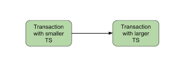
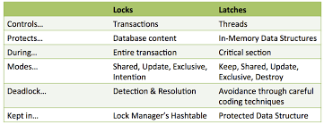

### Topic : Concurrency Control

In database management system, keeping track of who's accessing what and when can be a real puzzle. Imagine trying to navigate a crowded room where everyone wants to talk at once. That's where concurrency control comes into play. It's like the traffic controller at a busy intersection, making sure everyone gets their turn without crashing into each other. In this journal, I will share my understanding based on three key methods of concurrency control: Two-Phase Locking, Timestamp Ordering, and Locks and Latches. 

### Two phase locking (2PL)

The two-phase locking protocol divides the execution phase of the transaction into three parts. These parts are given below:

- First part: when the execution of the transaction begins, it seeks permission from the lock it requires.

- Second part: when the transaction acquires all the locks, the third part starts as soon as the transaction releases the first lock.

- Third part: The transaction cannot demand any new locks at that phase; it can only release the acquired locks.

There are two phases of two-phase locking:

### Growing phase:

The issuing of all the locks is done in this phase. In this, a new lock may be acquired by the transaction on the data item, but none can be released.

### Shrinking phase:

No locks are issued in this phase, and all the changes to the data items are stored; later on, locks are released.

Example:
Let us take an example to understand this clearly. Suppose there are two transactions, T1 and T2.

Here, 

Lock–S(A): can’t execute Lock–S(A), since A is locked by transaction T1.

Lock–X(C): can’t execute Lock–X(C), since C is locked by transaction T2.

And, Unlock(A) means unlocking of A.

The same goes for S(A) and S(B).

In the above example, the following phase may happen if the lock conversion is allowed:

Upgrading of the lock is allowed in the growing phase( from S(A) to X(A) ).
Downgrading of the lock must be done in the shrinking phase( from X(A) to S(A) ).

The following way shows how locking and unlocking happen in two-phase locking(2PL).

In transaction T1:

- Growing phase: from steps 1 to 3
- Shrinking phase: from steps 5 to 7
- Lock point: at step 3

In transaction T2:

- Growing phase: from steps 2 to 6
- Shrinking phase: from steps 8 to 9
- Lock point: at step 6

Following are the most common types of Two-phase locking protocol:

- Strict two-phase locking protocols
- Rigorous two-phase locking protocols
- Conservative two-phase locking protocols

### Strict two-phase locking protocols
The first phase of strict two-phase locking is similar to the two-phase locking. The transaction continues to execute normally after acquiring all the locks.

The only difference between strict 2PL and 2PL is that strict two-phase locking does not release a lock after using it. On the other hand, it waits for the whole transaction to complete, and then it releases all the locks.

### Rigorous two-phase locking protocols
Rigorous two-phase locking protocols avoid cascading rollbacks.
In this, all the shared and exclusive locks are only released when the whole transaction completes.

### Conservative two-phase locking protocols
Conservative two-phase locking protocols are used in relational databases. This method of locking prevents deadlock but does not prevent starvation and cascading rollback.
All locks are acquired before the beginning of the transaction no acquisition in-between transactions, therefore, no deadlock but the rollback problem still is there.

### What is Timestamp Ordering Protocol?
Timestamp ordering protocol maintains the order of transaction based on their timestamps.

It is a unique identifier that is being created by the DBMS when a transaction enters into the system. This timestamp can be based on the system clock or a logical counter maintained in the system.
Timestamp helps identifying the older transactions (transactions that are waiting in line to be executed) and gives them higher priority compared to the newer transactions. This make sure that none of the transactions are pending for a longer period of time.
This protocol also maintains the timestamps for the last read and last write on a data.

For example, let’s say an old transaction T1 timestamp is TS(T1) and a new transaction T2 enters into the system, timestamp assigned to T2 is TS(T2). Here TS(T1) < TS(T2) so the T1 has the higher priority because its timestamp is less than timestamp of T2. T1 would be given the higher priority than T2. This is how timestamp based protocol maintains the serializability order.

### Advantages of Timestamp based protocol

- Schedules managed using timestamp based protocol are serializable just like the two phase protocols.
- Since older transactions are given priority which means no transaction has to wait for longer period of time that makes this protocol free from deadlock.

### Locks and Latches

### Locks

Locks are mechanisms used to control access to shared resources, such as data items, to ensure data consistency and integrity in a multi-user environment.

### Types of Locks:

- Shared Locks (S-Lock): Allows multiple transactions to read a resource but prevents any transaction from writing to it.

- Exclusive Locks (X-Lock): Allows only one transaction to access the resource for writing while preventing any other transaction from reading or writing to it.

### Granularity of Locks:

- Row-Level Locks: Locks individual rows in a table.
- Table-Level Locks: Locks the entire table.
- Page-Level Locks: Locks a data page which contains multiple rows.

### Lock Modes:

- Intent Locks: Indicates the intention of a transaction to acquire a certain type of lock on a resource.
- Conversion Locks: Occurs when a transaction wants to change the type of lock it holds on a resource.

### Lock Management:

- Lock Manager: A component of the DBMS responsible for managing the acquisition and release of locks.

- Deadlock Detection and Prevention: Techniques used to identify and resolve deadlocks, where two or more transactions are waiting for each other to release locks.

### Lock Compatibility:
Ensuring that multiple transactions can access resources concurrently without causing conflicts. For example, a shared lock is compatible with other shared locks but not with an exclusive lock.

### Latches

Latches are lightweight synchronization mechanisms used to protect in-memory data structures within a single process or thread.

### Characteristics:

- Typically used for short-term protection of data structures during critical sections of code execution.
- Latches are usually acquired for a very short duration and are released immediately after the critical section is executed.

### Types of Latches:

- Shared Latches (S-Latch): Allows multiple threads to access a resource concurrently for reading.

- Exclusive Latches (X-Latch): Allows only one thread to access a resource for writing while preventing any other thread from accessing it.

### Usage:
Latches are commonly used in buffer management, index management, and other internal components of the DBMS to protect critical data structures.

### Granularity:
Latches are typically applied at a finer granularity compared to locks and are used within the internals of the DBMS to protect specific data structures like buffers, index nodes, etc.

### Difference Between Lock and Latches 

### Conclusion

In conclusion, concurrency control mechanisms like Two-Phase Locking, Timestamp Ordering, and Locks and Latches are essential for maintaining data consistency and integrity in database management systems. Two-Phase Locking ensures transaction isolation through growing and shrinking phases, with variants like Strict and Rigorous 2PL adding further safeguards. Timestamp Ordering prioritizes transactions based on timestamps, preventing deadlock and ensuring timely execution. Locks and Latches manage resource access, with locks controlling shared and exclusive access and latches providing lightweight synchronization within a process or thread. 

### What I did in flipped class.

Normal class was taken where we were learned totally by being taught by our tutor.

### How can flipped class be Improved.

No further change is required!.