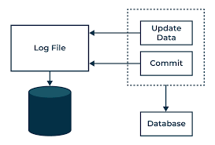
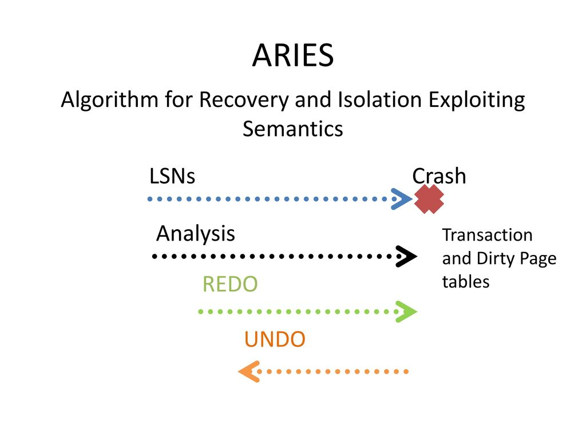
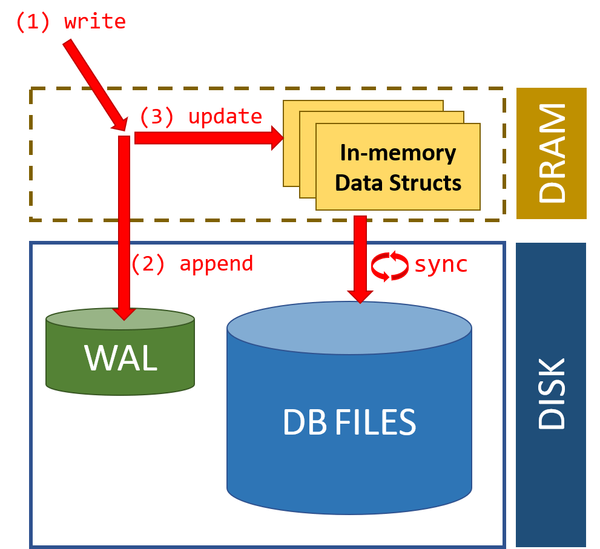

### Topic : Recovery System

In database management system, the importance of recovery algorithms cannot be overstated. These algorithms serve as the backbone of data integrity, ensuring that even in the face of system failures or crashes, databases can be restored to a consistent state without loss of critical information. In this journal, I will share what I have learned after learning the realm of recovery algorithms, exploring traditional methods like ARIES, alongside newer researched algorithms, and the crucial role of database logging.

### Recovery Algorithms

Recovery algorithms are techniques to ensure database consistency, transaction atomicity, and durability despite failures.

Recovery algorithms have two parts:
- Actions during normal txn processing to ensure that the
DBMS can recover from a failure.
- Actions after a failure to recover the database to a state
that ensures atomicity, consistency, and durability.

### 1. Ensuring Database Consistency, Transaction Atomicity, and Durability Despite Failures:

In the world of database management, consistency, atomicity, and durability are like the holy trinity.

Consistency means that the database should always be in a valid state. If a transaction starts with a valid database and ends successfully, the database should remain valid throughout the process.

Atomicity is all about "all or nothing." Transactions should either be completed in full or not at all. If something goes wrong midway through a transaction, the database should roll back to its previous state, as if the transaction never happened.

Durability is the promise that once a transaction is committed, its changes are permanent. Even if there's a power outage or a system crash, the changes made by committed transactions should be preserved.

### 2. Actions During Normal Transaction Processing:

To ensure recovery from failures, databases take precautions during normal transaction processing.

Logging Changes: Every time a transaction makes changes to the database, these changes are logged. This log serves as a record of what happened, allowing the system to reconstruct the database in case of a failure.

Maintaining Checkpoints: Periodically, the database system creates checkpoints. Think of them as snapshots of the database's current state. These checkpoints are crucial during recovery, as they provide reference points for where to start rebuilding the database.

### 3. Actions After a Failure:

When a failure occurs, the database needs to spring into action to get things back to normal.

Analysis of Logs: The system analyzes the log to determine the most recent checkpoint and the transactions that were in progress at the time of the failure. This analysis helps identify which transactions need to be redone or undone during recovery.

Redo and Undo Operations: Based on the analysis, the system performs redo and undo operations. Redo operations reapply changes from committed transactions that were not yet reflected in the database before the failure. Undo operations rollback changes from transactions that were in progress but not yet committed at the time of the failure.

### ARIES

ARIES (Algorithm for Recovery and Isolation Exploiting Semantics) is a database recovery and concurrency control algorithm used to maintain the consistency of databases despite system crashes or failures. It was proposed by C. Mohan, D. Haderle, B. Lindsay, H. Pirahesh, and P. Schwarz in 1992.

The fundamental concept behind ARIES is its use of a Write-Ahead Logging (WAL) protocol coupled with a system of checkpoints. Here's a detailed explanation of its key components and how it works:

### Write-Ahead Logging (WAL):

- ARIES logs all changes to the database in a special file called the log. This log records both the old and new values for each modified data item.
- Crucially, ARIES ensures that the log entry for a particular update is written to disk before the actual data modification takes place. This ensures durability, meaning that even if the system crashes, the changes can be reconstructed from the log.

### Recovery Process:

- When a system crash occurs, ARIES uses the log to recover the database to a consistent state.
- It first performs an analysis phase, scanning the log from the most recent checkpoint to the end to determine which transactions were active at the time of the crash and which updates were made but not yet reflected in the database.
- Then it performs a redo phase, during which it reapplies the updates recorded in the log to the database to bring it up to the state it was in at the time of the crash.
- Finally, it performs an undo phase, where it uses the log to reverse any incomplete transactions that were active at the time of the crash, restoring the database to a consistent state.

### Checkpoints:

- ARIES periodically takes checkpoints to provide a point from which recovery can start.
- During a checkpoint, ARIES writes a special record to the log that indicates the current state of the database.
- Checkpoints serve two main purposes: to reduce the amount of log to be analyzed during recovery and to minimize the time needed for recovery.

### Concurrency Control:

- ARIES supports various concurrency control mechanisms, such as locking or timestamp-based methods, to ensure that transactions execute correctly and do not interfere with each other.
- It ensures that transactions are serialized correctly even in the presence of concurrent execution and system failures.

### Logging and Undo/Redo Records:

- ARIES uses a variety of log records to record different types of database operations, including updates, commits, aborts, and checkpoints.
- It employs undo and redo logs to ensure that transactions are either completely applied or completely undone during recovery, preserving the atomicity and durability properties of transactions.

ARIES is a robust and efficient algorithm for database recovery and concurrency control, widely used in commercial database management systems due to its effectiveness in handling system crashes and ensuring database consistency.

### DB Logging
Database logging, a fundamental component of database management systems (DBMS), involves recording changes made to the database in a log file. This log file serves several important purposes, including recovery from system failures, maintaining data integrity, and supporting various database functionalities. Here's a detailed explanation of database logging:

### Purpose of Logging:

The primary purpose of logging is to facilitate database recovery in the event of system crashes or failures. By recording changes to the database in a log file, the DBMS can reconstruct the state of the database at the time of the crash and restore it to a consistent state.
Logging is essential for supporting concurrency control mechanisms in multi-user database systems. It helps ensure that transactions are serialized correctly and that changes made by concurrent transactions are properly managed. Logging can also serve as an audit trail, providing a record of all modifications made to the database. This is important for tracking changes, troubleshooting issues, and maintaining data integrity.

Database logs can be used for performance monitoring and optimization purposes, allowing administrators to analyze database activity, identify bottlenecks, and improve system performance.

### Types of Log Records:

- Update Records: These records capture changes made to the database by transactions, including insertions, updates, and deletions of data items. Update records typically contain the old and new values of the modified data items.
- Transaction Records: Transaction records indicate the beginning, commit, or abort of transactions. They provide information about the lifecycle of transactions and help ensure the atomicity and durability properties of transactions.
- Checkpoint Records: Checkpoint records mark points in the log where the DBMS has flushed modified data pages to disk and ensured that all log records up to that point are durable. This helps accelerate recovery by reducing the amount of log to be analyzed.
- Undo and Redo Records: These records are used during recovery to either undo or redo changes made by transactions. Undo records contain information necessary to reverse the effects of an incomplete transaction, while redo records contain information necessary to reapply changes to the database.

### Conclusion.

In conclusion, the realm of recovery algorithms stands as a cornerstone in maintaining the integrity and reliability of database systems, ensuring that crucial data remains consistent and accessible even in the face of system failures or crashes. Through mechanisms like ARIES and traditional logging practices, databases are equipped to handle failures gracefully, employing strategies such as Write-Ahead Logging (WAL) and periodic checkpoints to facilitate efficient recovery processes. Understanding the principles of database logging, recovery algorithms, and concurrency control mechanisms is paramount for database administrators and developers alike, empowering them to build robust and resilient systems capable of withstanding unforeseen challenges and disruptions.

### What I did in flipped class.

Normal class was taken where we were learned totally by being taught by our tutor.

### How can flipped class be Improved.

No further change is required!.

