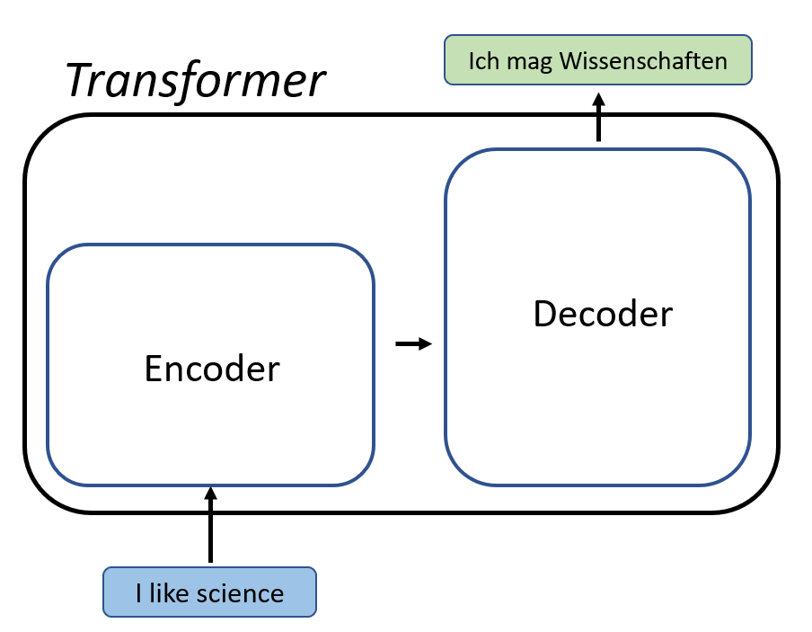
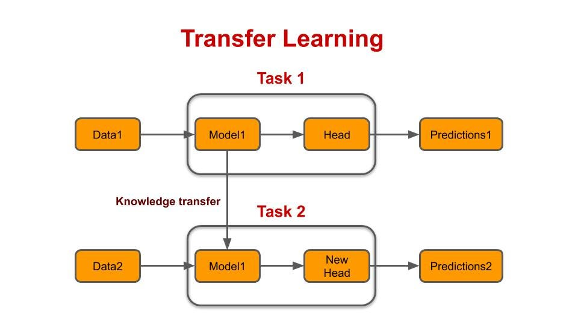

### Topics: Transformers, Diffusion Models, and Transfer Learning

Today, I want to share some of the fascinating topics that I have been exploring: Transformers, Diffusion Models, and Transfer Learning. Each plays a crucial role in advancing the capabilities of AI systems, enabling them to process natural language, predict the spread of phenomena, and efficiently adapt to new tasks.

#### Transformers: The Building Blocks of Modern AI
Transformers have revolutionized the field of AI, especially in natural language processing (NLP). But what exactly are they?

#### What Are Transformers?
Transformers are a type of neural network architecture introduced in a groundbreaking paper by Vaswani et al. in 2017. They were designed to handle sequential data, like sentences or time series, more efficiently than previous models. The key innovation of Transformers is the self-attention mechanism.

#### Self-Attention Mechanism
Self-attention allows the model to weigh the importance of different words in a sentence relative to each other. For example, in the sentence "The cat sat on the mat," the word "cat" is related to "sat" and "mat." The self-attention mechanism helps the model understand these relationships by assigning different weights to each word's influence.

#### Why Are Transformers Important?
Transformers have become the backbone of many advanced AI models, like GPT (Generative Pre-trained Transformer) and BERT (Bidirectional Encoder Representations from Transformers). These models can generate coherent text, translate languages, and even write poetry, all thanks to the power of Transformers.

#### Diffusion Models: Modeling the Spread of Information
Now, let's move on to Diffusion Models. These are used to understand how information or phenomena spread over time.

#### What Are Diffusion Models?
Diffusion Models simulate how something (like heat, particles, or information) diffuses through a medium. In AI, these models can be used to understand and predict the spread of information across networks, like social media or biological systems.

#### How Do They Work?
Imagine you drop a drop of ink into a glass of water. Initially, the ink is concentrated in one spot, but over time, it spreads out evenly throughout the water. Diffusion Models mathematically represent this process. They can be used in various fields, from predicting how diseases spread to how rumors circulate online.

#### Applications of Diffusion Models
Diffusion Models can help with:

- Social Network Analysis: Predicting how information spreads through social media.
- Epidemiology: Modeling the spread of diseases to help public health planning.
- Physics and Chemistry: Understanding how particles move in different environments.
- Transfer Learning: Reusing Knowledge for New Tasks
Finally, let's talk about Transfer Learning, a powerful technique that allows AI models to apply knowledge from one task to another.

#### What Is Transfer Learning?
Transfer Learning involves taking a pre-trained model on a large dataset and fine-tuning it for a different, but related task. This approach saves time and computational resources because the model doesn't have to learn everything from scratch.

#### How Does Transfer Learning Work?
Let's say we have a model trained to recognize objects in thousands of images. We can take this pre-trained model and fine-tune it to recognize medical images, like X-rays, with much less data and effort than starting from zero.

#### Why Is Transfer Learning Useful?
- Efficiency: It reduces the need for massive amounts of data and computational power.
- Versatility: It allows models to be adapted for various tasks quickly.
- Improved Performance: Fine-tuning a pre-trained model often results in better performance than training a model from scratch.
- Real-World Applications
- Healthcare: Diagnosing diseases from medical images.
- Finance: Detecting fraudulent transactions.
- Natural Language Processing: Adapting language models for specific domains like legal or medical texts.

### Conclusion
In summary, Transformers, Diffusion Models, and Transfer Learning are three key concepts driving the advancement of AI. Transformers excel at understanding and generating natural language, Diffusion Models help us predict how things spread, and Transfer Learning allows us to leverage existing knowledge for new tasks. Together, these innovations are paving the way for smarter, more efficient AI systems.