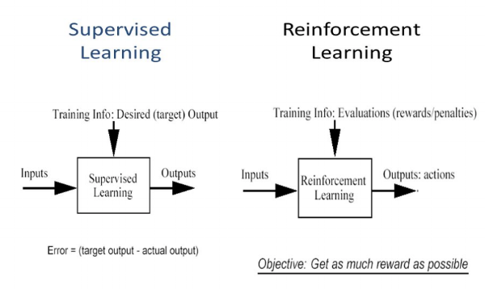
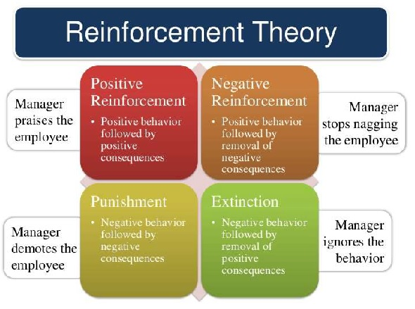

### Topics: Reinforcement Learning

Reinforcement Learning (RL) has always interested me, and I am excited to share what I have learned about this fascinating topic. Let's dive into the basics understanding I have and see why it's so talked about these days.

#### What is Reinforcement Learning?
Reinforcement Learning is a type of machine learning where agents learn by interacting with their environment through rewards and penalties. The goal is for the agent to maximize total rewards by taking the best possible actions in different situations. Essentially, an agent perceives and interprets its environment, takes actions, and learns from the outcomes.

#### How Does Reinforcement Learning Work?

- Start in a State: The agent starts in a state that represents its current situation in the environment.
- Take an Action: Based on its current strategy, the agent selects an action.
- Receive Reward or Penalty: The environment gives feedback in the form of rewards or penalties.
- Observe New State: The environment moves to a new state after the action.
- Update Strategy: The agent updates its strategy to favor actions that maximize future rewards.

#### Key Terms

- Agent: The learner and decision-maker.
- Environment: The world in which the agent operates.
- Action Space: All possible actions the agent can take.
- State: The current situation of the agent.
- Reward: Feedback from the environment based on the agent’s action.
- Policy: The strategy that the agent uses to decide actions.
- Value Function: Estimates the expected reward for states or actions.
- Model: Sometimes used to predict the environment's behavior.

#### Characteristics of Reinforcement Learning
- No supervision, only real value or reward signals.
- Sequential decision making.
- Time plays a crucial role.
- Feedback is delayed.
- The agent's actions determine the next data received.

#### Differences from Supervised Learning
- Supervised Learning: Uses labeled data, learns from predefined outputs.
- Unsupervised Learning: Finds patterns in unlabeled data.
- Reinforcement Learning: Learns from rewards and penalties without labeled data.

#### Types of Reinforcement Learning
- Positive Reinforcement: Strengthens behavior by giving a positive outcome.
- Negative Reinforcement: Strengthens behavior by removing a negative condition.

##### Widely Used Models for Reinforcement Learning
- Traditional RL Models: Such as Markov Decision Processes (MDPs) and Q-Learning.
- Deep Reinforcement Learning Models: Like Deep Q-Learning and Policy Gradient Methods.

#### Practical Applications
- Robotics: Industrial automation and robot motion control.
- Text and Speech: Summarization engines and dialogue agents.
- Autonomous Vehicles: Self-driving cars.
- Game AI: Building intelligent agents for games.

### Conclusion
In conclusion, Reinforcement Learning helps in determining actions that maximize long-term rewards, although it can struggle in complex environments. It’s a fascinating field that combines elements of trial-and-error learning with strategic decision making. 