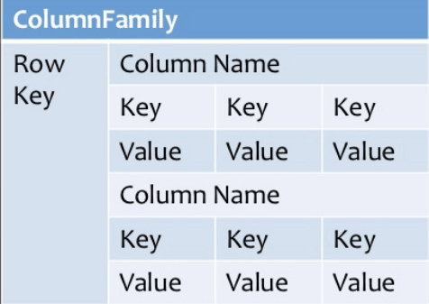

### Topic : Market Place

In this project, we embarked on developing a full-stack web application that models a popular digital service marketplace(Website for Auction place). The aim was to create a platform similar to eBay, Craigslist, or Etsy, incorporating essential features such as pagination, user authentication and authorization, RESTful API endpoints, and real-time data communication using WebSockets. This journal documents the journey, including the development process, challenges encountered, and how we addressed them as a group and individual by doing out parts in the project.

#### Planning and Design

Before planning and designing we went onto looking foe a website inspiration as sir instructed and it looks like this:

- https://www.figma.com/community/file/1012786849389587697

and we designed a sample in figma like this:

Our initial step was to plan and design the application's architecture. We chose the following technology stack:

- Frontend: React.js and Next.js for building a responsive user interface.
- Backend: Use Typescript to create the server and RESTful API.
- Database: sqlite for storing user, product and marketplace data.
- Authentication: JWT (JSON Web Tokens) for secure user authentication and authorization.
- Real-Time Communication: WebSockets (Socket.io) for enabling active chatting and bidding place.

We outlined the core features and divided them into manageable tasks:

1. User Authentication and Authorization
2. RESTful API Development
3. Pagination Implementation
4. Real-Time Data Communication

And from this part individual members of the group will share how there journey was while doing the project:

### Tandin Zangmo's Journal

I set up the Signup and Login page using React by having the code run on the client-side with the command used, “use client”. For state, I imported the useState hook which is one of the hooks provided built-in hooks which can be used by default in functional components, and I also imported a BUTTON component from a UI library. I took state for user input (name, phone number, email and password) and state for errors (for validation) using useState. I defined a handleSubmit function to stop the form submission, and with the help of formik library to validate the inputs and with the help of axios library I made a POST request to the server with the data of the user and logged the responses accordingly. Also, the handleChange function modifies the form data as the user is inputting data. The form created using the JSX and designed on the Tailwind CSS contains the forms’ input, prompts the errors, users’ assistance links, a primary submit button, the Google sign-in option, and the link for creating the new account to make the form easily navigable and functional.

Things I learned after finishing this assignment are;
I learned how to setup client-side by using React.I also learned how to make sure that there is no error while receiving the information with a feature usestate to handle form input data (such as name, phone number, email, and password) and to manage error states for form validation and also knew how to make all the parts filled without anything left behind. I also learned how to use multiple accounts in different browsers and implementing web sockets.

### Kelden Phuntsho Dorji's Journal 

While assembling the home page of RabsAuction, I learned about the necessary steps which contribute to the creation of an intuitive interface of an online auction site. Integrating React and Next. It made me able to manage the state of the application using hooks like useState when like when it came to interactions such as selecting the auction rooms and managing the visibility of the modal. By implementing the responsive design in the layout of the UI made it possible making the platform accessible in the different devices, increasing the usability factor. Further, utilizing TypeScript for type-checking ensured strength and precision when declaring the Room interface due to the conformity it offered across the application domain. Components like Modal made it easy to show extra pertinent information about certain rooms; it proved helpful for making the notion of the direct participation in certain auctions exclusive enough. In conclusion, what this project has shown is that when it comes to UI/UX design, state management, and matters of component reusability, the end goal of an online auctions application cannot be achieved flippantly.

### Kuenzang Rabten's Journal

During this phase of our project, we made good progress. We started by finishing our Figma designs and setting up our GitHub repository. I worked on designing the frontend welcome page, making changes to its layout and functionality. We had discussions with the team to plan our next steps once everyone had finished their tasks. A major achievement was connecting my welcome page with Tandin's login and signup features, making sure they worked with the backend endpoints and updating the frontend design as needed. Additionally, I worked on the UI designs using shadcn on websockets and collaborated with Tenzin Namgay on the chatroom feature. By the end of this phase, I had finished the UI design as it was simple for me since Douglas Sir already gave the sample of it by giving his githubrepository and then tried linking the frontend with the backend and which made a good progress at the end.

Things that I have learned while doing the project:

Completing this project was a great learning experience for me. First, I learned the importance of proper planning and design. Starting with a well-thought-out Figma design helped streamline the development process and ensured that everyone was on the same page.

I gained significant experience with React and Next.js, particularly in managing state and creating a responsive user interface. Working with the shadcn UI library was a new experience for me, and it taught me how to use pre-built components to speed up the development process while maintaining a cohesive design.

Collaborating with my teammates on integrating the frontend and backend was a valuable lesson in teamwork and communication. I learned how crucial it is to ensure that all parts of the project are compatible and how to troubleshoot issues that arise when different parts of the system are brought together.

One of the most challenging but rewarding parts of the project was working with WebSockets for real-time communication. This was my first time implementing WebSockets, and it taught me a lot about real-time data handling and the intricacies of setting up a chatroom feature. It also highlighted the importance of error handling and debugging in real-time applications.

Finally, this project underscored the importance of version control and collaborative tools like GitHub. Keeping our repository organized and maintaining clear communication through commit messages and pull requests was essential for our team's success.

Overall, this project was a comprehensive learning experience that enhanced my skills in frontend development, real-time communication, and team collaboration. I am confident that the lessons I learned will be invaluable in my future projects.

### Tshering Phuntsho's Journal

In my final assignment for WEB101 and WEB102, I did the frontend part. Our group was task to develop an auction website. It was really interesting to do real time project and working with team members. Although we started the project with the little knowledge, now we learned lots of things after completing the project. I knew how to work collaboratively and what kind of challenges are faced which improved me for the upcoming projects and for the job market.

### Sonam Dorji Ghallay's Journal 

On the first day I started off with discussing the framework of our project and how to go about with the project and after that I started working on the backend with my members. There we firstly set up our server and the hono framework and prisma ORM. and we made a rough sketch of our database scheme  and after that we proceeded on making the schema for our database. 
After completion of the schema we consulted it with our tutor and made further changes to our schema. 
On the next day we started working on our endpoint for the with respect to our schema and there we faced of problem while making the endpoint because we applied protected routing and handling the jwt token was a bit difficult for us but our tutor again helped us with that
After completion of the endpoint we processed on the websocket for our chat room and were this the main issue with us because it was bit new to us but we completed that as well 
Finally connecting all the frontend, backend and websocket was the real deal because connecting all of them was a bit hard because we had little idea on connecting them and in this part was where we stuck the most but after the consultation from our tutor we we again able to complete it . 
However we were successfully able to complete this project with all the up and downs and from this I got experience on how to work in a group and mostly how to build a fully functional web page.

### Tenzin Namgay's Journal  
We focused on several important tasks. We started by discussing what needed to be added to the schema, with a particular focus on the auction room. We had multiple discussions on websockets, including a Zoom meeting with Douglas Sir to get a clearer understanding. I was able to make good progress coding the websocket. Tashi and I planned how to use JWT tokens for user IDs and room IDs. The entire backend team collaborated to connect the backend with the frontend, and we talked with Sir about how to obtain tokens. Kuenzang Rabten and I discussed the design of the chatroom for websockets and updated the code to include JWT tokens. Finally, we used Tashi's endpoint to get tokens needed to enter the chatroom and made a good progress.

What I learned during project:

During the project on this live auction, I learned many things. It corrected my full concept understanding of connecting the database and server. During this work, it was very hard to identify the relationship cardinality for each entity, but the problem was solved with support from my tutor. That way, we were able to fix this particular problem and also I had an issue with the Bun library, but after reading through the documentation and with sir's guidance, I have now mastered using Bun.

On the next day, we backend members discussed the endpoints, led by our member Tashi-Penjor. We discussed implementing these endpoints, but it was mostly done by other members since I was very busy with AI CAP 3. However, I understood how the endpoints work. While discussing the endpoints, we had a problem implementing CRUD functionalities in the auction room and more, but with the support from sir, Tashi, and other backend members, we were able to complete half part of the endpoints. 

On the next day, I was about to start the WebSocket since I finished my AI CAP. However, problems arose on how to start and implement it. Again, with full support from our tutor, I was helped on how to start the WebSocket and was given a basic concept by being shown implemented example code and having it clearly explained. I then understood what was really needed for the WebSocket and started the code with the necessary implementation, but I couldn't run it as there was an error that was difficult to identify.

The next day, to resolve this problem, Tashi and I had a FaceTime Zoom meeting with our respected tutor. That night, sir sent a documentation on WebSocket for both backend and frontend, which was really helpful in clarifying the concept. That way, I was able to run it and made better progress than previous work by implementing a condition to define bid or chat messages. Not only that, sir also provided the following next steps:

1. You need to pass in JWT. From the JWT, you will get the userId.
2. You need to pass in the roomId/channelId to the WebSocket in the URL query so that the server knows which channel to publish to.
3. Third, here you are always passing it to a channel: auction. This should be dynamic from the roomId you pass to the WebSocket server.

That brought confidence and an interesting feeling to do the work, especially since our tutor was helping in every possible way. However, it was very difficult to follow all the steps mentioned above. It took me three days to complete this, but I still couldn't achieve proper results, like passing JWT to get the userId, and passing the roomId to the WebSocket, among other things. We shared the problem with our tutor, who did not hesitate and gave full dedication and support to help us.

So, the tutor arranged a Zoom meeting with the backend members. He sent us three repositories in the group chat and explained everything very clearly so that I understood all of it. Not only that, I also understood the workflow of these three repositories connected to each other ( websocketserver, next.js chatroom, restapi server, ), which really helped me to do it by myself.

After the Zoom meeting, I referred to the WebSocket server code and understood it. I was able to publish and subscribe to the channel, messages, and bids. The system could identify which were messages and which were bids. The next challenge was designing the frontend.
Kuenzang Rabten and I discussed how to design and connect the backend and frontend code. Since the backend was ready, we focused on the design. Rabten used Shadcn to implement buttons, avatars, an input bar for typing messages, and a bidding amount feature, as well as functionality for joining the room using the room ID (all for the WebSocket frontend). 

I worked on displaying all messages on the left side along with the avatar and email to show who sent the message. It was functioning as expected: all chats sent by different users were shown on the left side along with the avatar and email. On the backend side, the server could identify whether the frontend sent a message or a bid and who sent it. However, there was an issue: the bid was not displaying when the amount was set, and the bid button was clicked. We tried many ways to fix this but couldn't resolve it. In the end, with help from sir on a Zoom meeting, we were able to display the bid on the frontend by implementing the publish bid code in the backend part of the WebSocket. This fixed the error and displayed the amount bid on the frontend, which I will never forget.

Lastly, everything was good and great on my part, but sir mentioned a problem: when the previous bid is higher, the second bid should be higher than the previous bid, which was not functioning as intended. To tackle this, we still need to implement the logic to ensure that each new bid is higher than the previous one. Once this is resolved, we will have a complete full-stack web development project. With this, the project live auction comes to an end.

### Kinley Palden's Journal

Integrating the interfaces for different parts of RabsAuction’s application helped me to consolidate important lessons about structuring and implementing coherent and effective frontends with React and Next. js. By the usage of reusables such as Button and Card classes, I was able to create and sustain the homogeneity of the design across the pages – Home, LoginPage, SignUpPage—, and the reduced code duplication. Using state hooks like useState for handling state locally was possible to control the form inputs on the go and at the same time, provide easy to comprehend feedback in case of errors. Substituting calls for common operations such as login and registration illustrated the critical responsibility of API errors and responses when resulting in unreliable validation and, in turn, eroding user confidence. Responsive design fundamentals and client-side routing (Next.Link) maintained consistent and compatible device-agnostic user experience and made prompt improvements in the frontend web application development.

### Tashi Penjor's Journal

We focused on refining our database schema and made significant progress on the endpoints for uploading products. After thoroughly testing these endpoints, we handed them over to the frontend team. Additionally, we created endpoints for the auction room and passed them along to the frontend group. Tenzin Namgay and I discussed the websocket implementation with Douglas via Google Zoom for the server side. Since there was an issue with my auction endpoints assigning room IDs before creation, I re-edited and tested them before handing them to the frontend team. Tenzin Namgay, the other backend members, and I collaborated to resolve websocket issues highlighted during the Zoom meeting. We also worked together to connect the backend and frontend using the repository provided by Sir. Overall, our teamwork greatly improved the integration between the backend and frontend and still in progress.

For the entire project, I learned about creating endpoints, which primarily involve the CRUD (Create, Read, Update, Delete) functions essential for interacting with the database. This included setting up routes in the backend to handle requests and perform operations on the data. I implemented methods to create new entries, retrieve existing ones, update records, and delete them as needed.

In addition to developing these backend functionalities, I focused on connecting the frontend to the backend. This involved configuring API calls from the frontend to communicate with the backend endpoints. By setting up proper request handling, I ensured data could be sent to and received from the server efficiently.

moreover I learned that when I run both the frontend and backend on the same port, it conflicts with an error and prevents either service from functioning correctly due to port binding issues. To solve this issue, I have changed the ports for the frontend and backend to run on different ports, ensuring that each service operates without interference.

Overall, this project helped me gain comprehensive knowledge and practical experience in full-stack development, highlighting the importance of robust backend logic and connecting frontend for seamless application."

### Challeneges faced doing the project

Here are all the challenges we faced doing the project:

- Identifying the endpoints in the frontend design was difficult.
- Incubation WiFi was very slow, causing delays.
- Coding in the backend server was challenging, but Sir provided guidance.
- Difficulties in coding the workflow in schema, but Sir helped us.
- Facing many errors while using Shadcn, which was tough to work with.
- Had little difficulties with JWT tokens.
- Issues with user and product IDs took a lot of time to resolve.
- Most errors were related to Shadcn, including trouble positioning error messages.
- Unable to run the websocket server.
- Connecting ideas among team members was challenging at times.
- Coding took longer than expected, especially connecting registration with the backend.
- Not knowing how to connect frontend and backend.
- Difficulties with getting tokens for userID and roomID.
- Port problems.
- Could not merge the websocket server with the backend's server.
- Still faced difficulties in getting tokens and connecting some frontend parts.
- Hard to design based on the endpoints.
- Connecting frontend components resulted in many errors.
- Problem with one-to-one communication.
- Difficulties in connecting the websocket backend with frontend.
- Had a hard time understanding how to use Tailwind CSS.
- Integrating websocket into the main project was challenging.

### Conclusions

Throughout our project journey, we encountered several challenges that tested our problem-solving skills and teamwork. From grappling with slow WiFi and coding complexities in both frontend and backend servers, to navigating issues with Shadcn and JWT tokens, each obstacle provided valuable learning opportunities. Despite these difficulties, collaboration and guidance from our mentor played a crucial role in overcoming hurdles related to endpoint identification, websocket integration, and design implementation. While some tasks took longer than anticipated and required extensive troubleshooting, our persistence and collective effort led to significant improvements in connecting frontend components and resolving server-side issues. These challenges underscored the importance of adaptability and communication in achieving our goal of creating a functional auction website, preparing us well for future projects and endeavors in web development.